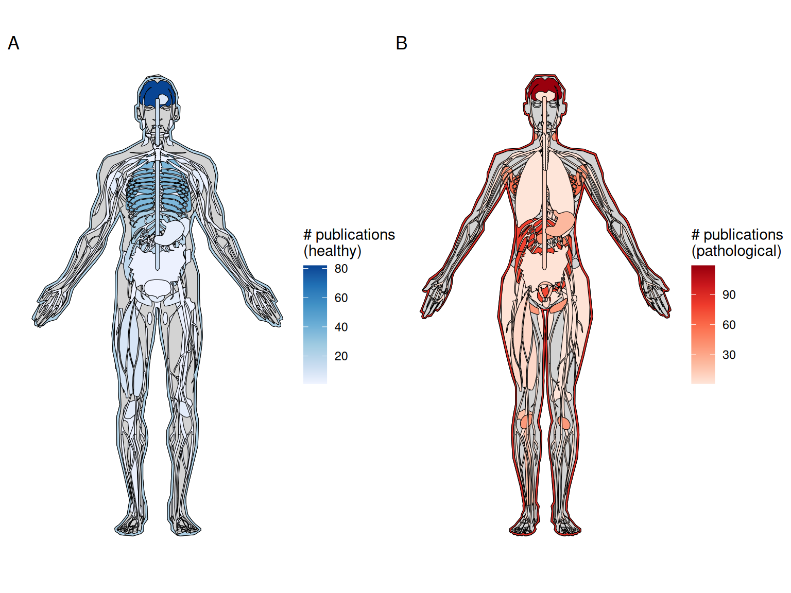
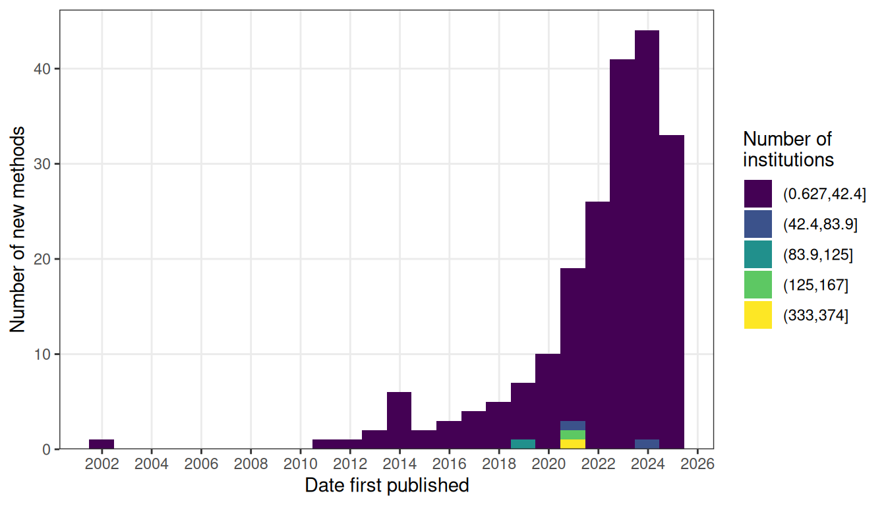
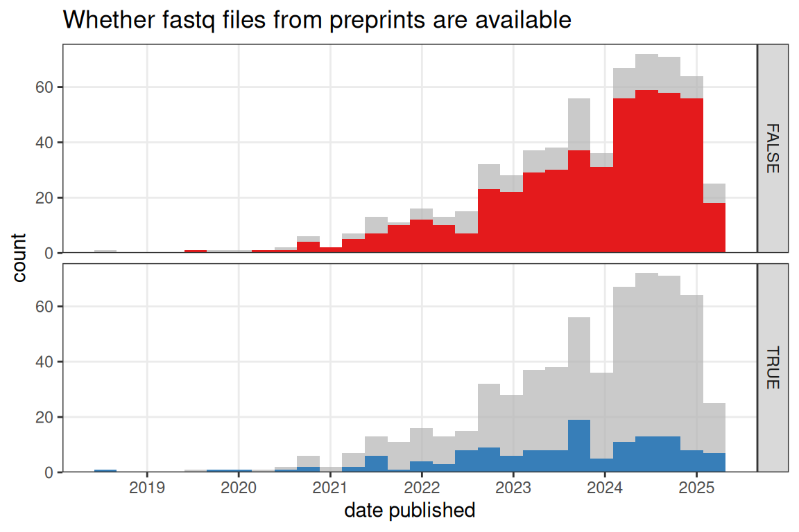
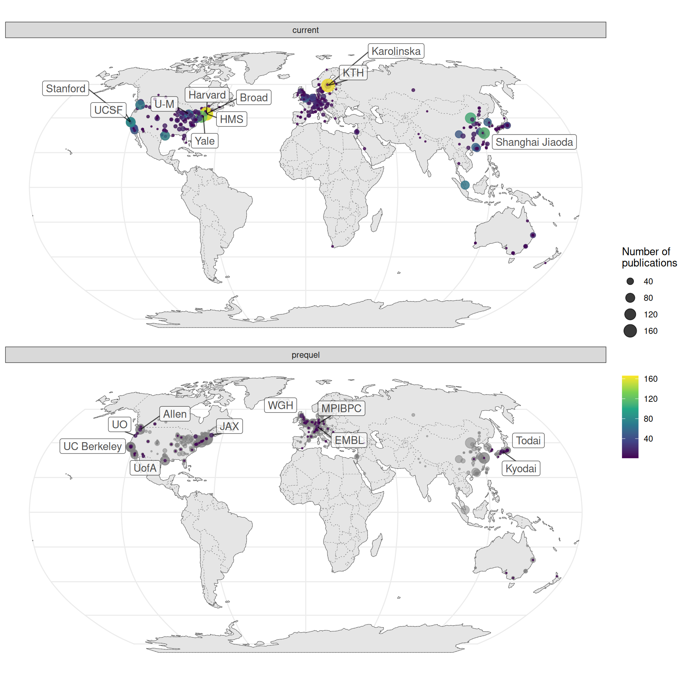
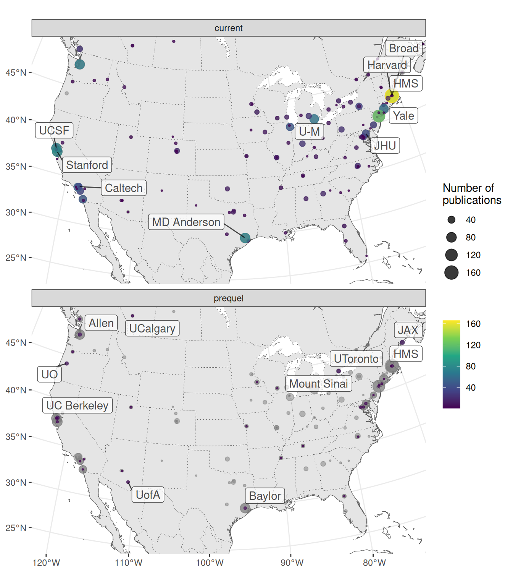
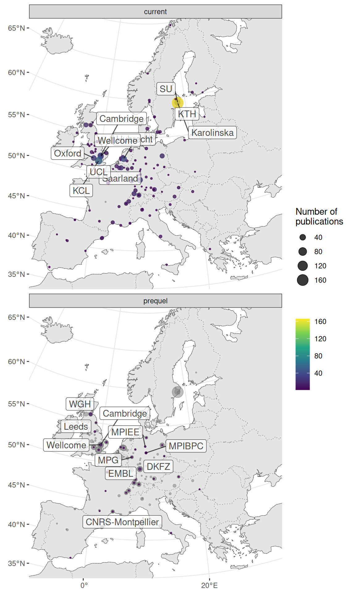
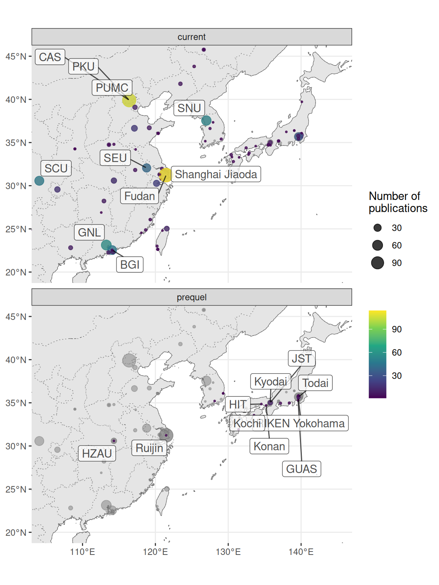

# (PART) Current era {.unnumbered}

# From the past to the present {#current}

## Legacy of the prequel era

The current era continues many of the quests of the prequel era, such as to profile the transcriptome in space, to identify genes with restricted expression, to classify gene expression patterns, to build reference gene expression atlases for model systems, and to infer anatomical regions based on gene expression. While the prequel era also sought to identify cell type markers, this has been taken over by non-spatial transcriptomics, which has been used to identify marker genes to stain for with spatial transcriptomics methods not easily scalable to the whole transcriptome. As already mentioned, (WM)ISH atlases can be understood as an improved alternative to microarray and *in situ* reporter screens, and the latter can be in turn understood as an improved alternative to enhancer and gene traps. To some extent, current era spatial transcriptomics started as an improved alternative to (WM)ISH atlases, to profile the whole transcriptome in the same cells [@Junker2014; @Lee2014]. On the other hand, part of current era of spatial transcriptomics can be seen as an improvement to bulk microarray or RNA-seq [@Brown2002; @Junker2014; @Stahl2016a; @Luo1999], and lower throughput single cell biology [@Lubeck2012; @Chen2015].

How does the current era relate to the prequel era in general? The current era has undergone massive growth unseen in the prequel era (Figure \@ref(fig:current-vs-prequel)). Unlike in the prequel era, current era technologies are typically highly multiplexed to quantify hundreds to thousands of genes if not the transcriptome within the same piece of tissue. While cell segmentation of bright field (WM)ISH images is challenging, in some current era technologies, transcripts can be traced back to the individual cells of origin. Moreover, cost of NGS has greatly decreased, and the most popular current era techniques -- LCM followed by RNA-seq, and 10X Visium -- rely on NGS to quantify transcripts, thus making it much more efficient to profile transcriptomes in space than with (WM)ISH, let alone enhancer and gene traps. 

Again, we may take inspiration from histories of other technologies that have no doubt undergone revolutions to illustrate where we are in what appears to be a revolution in progress in part propelled by NGS and greater computing power. The growing popularity and greatly improved efficiency of current era techniques compared to those of prequel techniques in applications to thousands of genes may be akin to how the safety bicycle relates to the penny-farthing. The advances from the former has rendered the latter virtually obsolete, and nearly all bikes we see on the streets today are much more like the safety bicycle in both appearance and mechanism than the penny-farthing. Since the 1890s, when the safety bicycle became popular, bicycle technologies have drastically improved. However, most histories of cycling do mention the penny-farthing and its ancestors such as the bone shaker, velocipedes (where the "velo" in "velodrome" comes from), and the hobby horse. Some histories mention bicycles propelled by treadles rather than the familiar cranks and a 17th century four wheeled human powered vehicle propelled by pulling ropes from within. Despite these vehicles' drastically different mechanisms from the modern bicycle, as these are earlier and less successful attempts to achieve the goal of devising a human powered land vehicle that travels faster than walking, which is still one of the primary goals of modern bicycle-related technologies. These histories are really histories of the quest to achieve that goal.

Moreover, when you see a lightening fast high-tech aerodynamic carbon fiber time trial bike tested in an aerospace wind tunnel, the penny-farthing is not to be forgotten, because the former still benefits from legacies from the latter. Roads used to be unpaved and very rough, and in the US, the paved roads, road signs guiding travelers, and interstates originated from advocacy by the League of American Wheelmen (LAW) since 1880, which was the penny-farthing era [@Guroff2016]. The same may be said for the UK [@Reid2011]. As the automobile replaced the safety bicycle as the favored mode of transportation in the 20th century (another revolution in transportation), drivers are not only benefiting from the better roads advocated by early cyclists but also the pneumatic tire originally popularized by the safety bicycle. Finally, without the legacy of LAW's advocacy, the modern form of fast road racing for which the high-tech carbon fiber time trial bike is built would not be possible. Today, LAW, which has been renamed League of American Bicyclists (LAB), is still operational as a cycling advocacy group.

On the one hand, just like the penny-farthing, which are now obsolete except in some hobbyist niches, prequel techniques can be seen as earlier and less successful attempts to achieve the goal to profile expression of as many genes as possible while preserving spatial context in tissue, less successful attempts whose disadvantages are addressed in newer and more successful attempts. While enhancer and gene traps and ISH atlases never completely died off (Figure \@ref(fig:hist1)), there is no doubt that to profile expression of larger number of genes in new studies, prequel techniques have by and large been replaced by current era techniques. On the other hand, just like LAW/B, the legacies of prequel spatial transcriptomics directly benefit the current era.

How has the prequel era influenced the current era? The direct influence does not seem profound overall when considering all biological systems studied, but is nevertheless sizable. For mouse brain studies, the Allen Brain Institute and its ABA do seem to have a bigger influence. The most obvious institutional continuation between the prequel and current eras is the Allen Brain Institute, which used ISH for the mouse ISH atlases, LCM and microarray for the human and macaque atlases, and generated bulk and scRNA-seq datasets as part of the atlases. Allen scRNA-seq data is often used to benchmark computational methods to map dissociated scRNA-seq cells to spatial locations in tissue and/or to impute gene expression in space (the two related tasks are collectively called spatial reconstruction of scRNA-seq here), with STARmap [@Wang2018b], osmFISH [@Codeluppi2018], MERFISH [@Zhang2020], and/or Visium [@Dou2020] mouse cortex data as the spatial reference [@Stuart2019a; @Cang2020; @Abdelaal2020; @Okochi2021; @Dou2020]; this is an institutional legacy from the prequel era. Another prequel era institutional legacy is the Jackson Lab (JAX), home of the prequel GXD, and where many lab mice come from. JAX has also contributed to the current era with the recent Visium mouse urinary bladder atlas [@Baker2021]. The data might soon be available for online exploration with `cellxgene` on the [JAX Single Cell Portal](https://singlecell.jax.org/) but is not yet available as of writing. However, for the most part, as shown later in this chapter, prequel and current era data collection techniques were developed and used in distinct institutions, suggesting that the two eras are largely sociologically distinct (Figure \@ref(fig:current-world)). This is not surprising given that different techniques in the current era are also often developed and used in largely distinct institutions (e.g. \@ref(fig:smfish-map)). 

The influence is mainly usage of prequel resources in current era data analysis, mostly in spatial reconstruction of scRNA-seq data and cross referencing to validate or interpret computational results. As already mentioned in Chapter \@ref(prequel), early scRNA-seq spatial reconstruction methods used binarized prequel style WMISH atlases for zebrafish embryos (Seurat v1) and *Platynereis* and whole mount FISH atlas BDTNP for *Drosophila* as spatial references. Thereafter the Seurat v1 zebrafish WMISH atlas and BDTNP have been used to benchmark several new spatial reconstruction methods [@Cang2020; @Sharma2020a; @Okochi2021], including methods developed for the DREAM challenge to map cells to locations with smaller number of informative genes [@Tanevski2020; @Alonso2020; @Pham2020a]. However, such benchmarks do not seem to indicate interest in studying the biology of zebrafish and *Drosophila* development in 3D, as the purpose of such benchmark is more to validate computational methods than to perform biological inferences. Furthermore, zebrafish and *Drosophila* only take up very small proportions of all current era studies compared to mouse and human (Figure \@ref(fig:species-pie)). For the mouse brain, the ABA mouse ISH atlas has been used as the spatial reference to quantitatively map scRNA-seq cell types to spatial locations [@Zeisel2018]. The Allen developing mouse brain ISH atlas was also used as spatial reference to map human brain organoid scRNA-seq cells to space and mouse developmental stages for interpretation [@Fleck2021]. Here, unlike the WMISH atlases and BDTNP, the ABA is not binarized before spatial mapping.

With staining for around 20,000 genes, the ABA is more frequently used to qualitatively confirm that the computationally imputed gene expression patterns recapitulate the ISH staining of the same genes [@Stuart2019a; @Welch2019; @Abdelaal2020; @Korsunsky2019; @Biancalani2020]. EMAGE eMouseAtlas [@Armit2017] has been used to qualitative validate Geo-seq [@Peng2016] and DBiT-seq [@Liu2020a] results, but usage of EMAGE is rare in the current era. In current era ST and Visium, an H&E image of the tissue accompanies the spatial transcriptome. The H&E image of mouse brains has been used to manually or computationally align the dataset to the Allen Mouse Brain Common Coordinate Framework (CCF) [@Wang2020] to integrate ABA's brain anatomical ontologies to new datasets to facilitate interpretation of the data [@Ortiz2020; @Chen2020; @Biancalani2020]. Even without H&E, Allen ontologies have been used to manually annotate HybISS data from the developing mouse brain based on marker gene expression [@LaManno2021]. In the mouse primary motor cortex (MOp) MERFISH atlas [@Zhang2020], Allen CCF was used to select the MOp region.

There are over 15 extant mouse databases from the prequel era (Figure \@ref(fig:dbs)), yet ABA is exceptional in its impact on the current era. We have never seen any mention of other prequel mouse databases, such as Eurexpress [@Diez-Roux2011], and GenePaint [@Yaylaoglu2005] in current era literature. This may be due to the following reasons: First, the ABA is the most comprehensive prequel atlas for the adult mouse brain, with around 20,000 genes for adult mice (P56). As of August 2021, EMAGE has ISH images for 17,554 genes, Eurexpress has 19,440 (that's the number of assays, but it seems that each gene typically has one assay, so it should be close to the number of genes), and GenePaint contains Eurexpress data and can query ISH data from several other databases including ABA. EMAGE covers a wide range of developmental stages, from E0.5 to E18, but not later stages and adults. Eurexpress only covers E14.5. The Allen developing mouse brain atlas covers from E11.5 to P28, though only with about 2000 genes. When the ABA is used in the current era, most of the time the adult mouse atlas is used. 

Second, the ABA has much better infrastructure to facilitate quantitative analyses of the atlas than the other prequel mouse atlases. Both EMAGE and Eurexpress have detailed annotation of ISH results for many genes and allow searching for genes with similar expression patterns. In addition, Eurexpress shows ISH for many consecutive sections in 3D, and EMAGE has 3D histology models (for morphology rather than gene expression) at different developmental stages. In addition to these functionalities, ABA quantified ISH staining and registered the quantified ISH to the CCF, so just like in scRNA-seq, each voxel would have a vector of gene expression values. Usage of ABA in the current era mentioned above would not be possible without the CCF. ABA also has an application programming interface (API) to automate retrieval of such quantitative data for analyses suitable for the quantitative nature of the current era. In contrast, we are unaware of such quantification, registration, and API in other prequel mouse atlases, thus restricting their uses to be more qualitative. A similar pattern can be seen in *Drosophila* prequel databases. BDTNP registered staining from thousands of embryos stained for different genes onto a common coordinate system. BDTNP data could also be easily downloaded as csv-like files that can be easily parsed, though as of August 2021, the [BDTNP website](http://bdtnp.lbl.gov:8080/Fly-Net/) is not responsive. As seen in \@ref(prequel-analysis), a reason why FlyExpress was commonly used was that images for different genes were registered in FlyExpress.

## Metadata of the current era

The current era started with LCM followed by microarray in 1999 [@Luo1999]. Due to the immense popularity of LCM followed by microarray or RNA-seq, the body of LCM literature is too vast for unbiased and comprehensive manual curation, so the curated database does not include most LCM literature, which was instead collected from a PubMed search and text mined (Figure \@ref(fig:topics), Chapter \@ref(text-mining)). Because the search results---without manual inspection and curation---may contain irrelevant entries and miss relevant ones, they are separated from the curated database in our analyses. Current era literature in the curated database is classified into Microdissection, smFISH, ISS, Array, and No Imaging, to be defined in detail in their corresponding sections below.

<table class="table" style="margin-left: auto; margin-right: auto;">
<caption>(\#tab:table1)Summary of spatial transcriptomics techniques in the current era</caption>
 <thead>
  <tr>
   <th style="text-align:left;"> Method </th>
   <th style="text-align:left;"> First published </th>
   <th style="text-align:left;"> Category </th>
   <th style="text-align:left;"> Max # genes </th>
   <th style="text-align:left;"> Min spot diameter ($\mu$m) </th>
  </tr>
 </thead>
<tbody>
  <tr>
   <td style="text-align:left;width: 6em; "> voxelation </td>
   <td style="text-align:left;width: 6em; "> 2002-02-01 </td>
   <td style="text-align:left;width: 6em; "> ROI selection </td>
   <td style="text-align:left;width: 6em; "> Tx wide </td>
   <td style="text-align:left;width: 6em; "> NA </td>
  </tr>
  <tr>
   <td style="text-align:left;width: 6em; "> PA-GFP </td>
   <td style="text-align:left;width: 6em; "> 2010-11-12 </td>
   <td style="text-align:left;width: 6em; "> ROI selection </td>
   <td style="text-align:left;width: 6em; "> Tx wide </td>
   <td style="text-align:left;width: 6em; "> NA </td>
  </tr>
  <tr>
   <td style="text-align:left;width: 6em; "> SRM seqFISH </td>
   <td style="text-align:left;width: 6em; "> 2012-06-03 </td>
   <td style="text-align:left;width: 6em; "> smFISH </td>
   <td style="text-align:left;width: 6em; "> 32 </td>
   <td style="text-align:left;width: 6em; "> single cell </td>
  </tr>
  <tr>
   <td style="text-align:left;width: 6em; "> Tomo-array </td>
   <td style="text-align:left;width: 6em; "> 2012-09-19 </td>
   <td style="text-align:left;width: 6em; "> ROI selection </td>
   <td style="text-align:left;width: 6em; "> Tx wide </td>
   <td style="text-align:left;width: 6em; "> NA </td>
  </tr>
  <tr>
   <td style="text-align:left;width: 6em; "> iceFISH </td>
   <td style="text-align:left;width: 6em; "> 2013-02-17 </td>
   <td style="text-align:left;width: 6em; "> smFISH </td>
   <td style="text-align:left;width: 6em; "> 20 </td>
   <td style="text-align:left;width: 6em; "> single cell </td>
  </tr>
  <tr>
   <td style="text-align:left;width: 6em; "> ISS </td>
   <td style="text-align:left;width: 6em; "> 2013-07-14 </td>
   <td style="text-align:left;width: 6em; "> ISS </td>
   <td style="text-align:left;width: 6em; "> 256 </td>
   <td style="text-align:left;width: 6em; "> single cell </td>
  </tr>
  <tr>
   <td style="text-align:left;width: 6em; "> Tomo-seq </td>
   <td style="text-align:left;width: 6em; "> 2013-08-12 </td>
   <td style="text-align:left;width: 6em; "> ROI selection </td>
   <td style="text-align:left;width: 6em; "> Tx wide </td>
   <td style="text-align:left;width: 6em; "> NA </td>
  </tr>
  <tr>
   <td style="text-align:left;width: 6em; "> bDNA-smFISH </td>
   <td style="text-align:left;width: 6em; "> 2013-10-06 </td>
   <td style="text-align:left;width: 6em; "> smFISH </td>
   <td style="text-align:left;width: 6em; "> 928 </td>
   <td style="text-align:left;width: 6em; "> single cell </td>
  </tr>
  <tr>
   <td style="text-align:left;width: 6em; "> TIVA </td>
   <td style="text-align:left;width: 6em; "> 2014-01-12 </td>
   <td style="text-align:left;width: 6em; "> ROI selection </td>
   <td style="text-align:left;width: 6em; "> Tx wide </td>
   <td style="text-align:left;width: 6em; "> NA </td>
  </tr>
  <tr>
   <td style="text-align:left;width: 6em; "> FISSEQ </td>
   <td style="text-align:left;width: 6em; "> 2014-03-21 </td>
   <td style="text-align:left;width: 6em; "> ISS </td>
   <td style="text-align:left;width: 6em; "> 8102 </td>
   <td style="text-align:left;width: 6em; "> single cell </td>
  </tr>
  <tr>
   <td style="text-align:left;width: 6em; "> seqFISH </td>
   <td style="text-align:left;width: 6em; "> 2014-03-28 </td>
   <td style="text-align:left;width: 6em; "> smFISH </td>
   <td style="text-align:left;width: 6em; "> 10421 </td>
   <td style="text-align:left;width: 6em; "> single cell </td>
  </tr>
  <tr>
   <td style="text-align:left;width: 6em; "> MERFISH </td>
   <td style="text-align:left;width: 6em; "> 2015-04-24 </td>
   <td style="text-align:left;width: 6em; "> smFISH </td>
   <td style="text-align:left;width: 6em; "> 4209 </td>
   <td style="text-align:left;width: 6em; "> single cell </td>
  </tr>
  <tr>
   <td style="text-align:left;width: 6em; "> Puzzle Imaging </td>
   <td style="text-align:left;width: 6em; "> 2015-07-20 </td>
   <td style="text-align:left;width: 6em; "> De novo </td>
   <td style="text-align:left;width: 6em; "> NA </td>
   <td style="text-align:left;width: 6em; "> NA </td>
  </tr>
  <tr>
   <td style="text-align:left;width: 6em; "> Geo-seq </td>
   <td style="text-align:left;width: 6em; "> 2016-03-21 </td>
   <td style="text-align:left;width: 6em; "> ROI selection </td>
   <td style="text-align:left;width: 6em; "> Tx wide </td>
   <td style="text-align:left;width: 6em; "> NA </td>
  </tr>
  <tr>
   <td style="text-align:left;width: 6em; "> corrFISH </td>
   <td style="text-align:left;width: 6em; "> 2016-06-06 </td>
   <td style="text-align:left;width: 6em; "> smFISH </td>
   <td style="text-align:left;width: 6em; "> 10 </td>
   <td style="text-align:left;width: 6em; "> single cell </td>
  </tr>
  <tr>
   <td style="text-align:left;width: 6em; "> ST </td>
   <td style="text-align:left;width: 6em; "> 2016-07-01 </td>
   <td style="text-align:left;width: 6em; "> NGS barcoding </td>
   <td style="text-align:left;width: 6em; "> Tx wide </td>
   <td style="text-align:left;width: 6em; "> 100 </td>
  </tr>
  <tr>
   <td style="text-align:left;width: 6em; "> HCR-seqFISH </td>
   <td style="text-align:left;width: 6em; "> 2016-10-19 </td>
   <td style="text-align:left;width: 6em; "> smFISH </td>
   <td style="text-align:left;width: 6em; "> 249 </td>
   <td style="text-align:left;width: 6em; "> single cell </td>
  </tr>
  <tr>
   <td style="text-align:left;width: 6em; "> punch </td>
   <td style="text-align:left;width: 6em; "> 2017-06-28 </td>
   <td style="text-align:left;width: 6em; "> ROI selection </td>
   <td style="text-align:left;width: 6em; "> Tx wide </td>
   <td style="text-align:left;width: 6em; "> NA </td>
  </tr>
  <tr>
   <td style="text-align:left;width: 6em; "> SGA </td>
   <td style="text-align:left;width: 6em; "> 2017-11-28 </td>
   <td style="text-align:left;width: 6em; "> smFISH </td>
   <td style="text-align:left;width: 6em; "> 35 </td>
   <td style="text-align:left;width: 6em; "> single cell </td>
  </tr>
  <tr>
   <td style="text-align:left;width: 6em; "> APEX-RIP </td>
   <td style="text-align:left;width: 6em; "> 2017-12-14 </td>
   <td style="text-align:left;width: 6em; "> De novo </td>
   <td style="text-align:left;width: 6em; "> NA </td>
   <td style="text-align:left;width: 6em; "> NA </td>
  </tr>
  <tr>
   <td style="text-align:left;width: 6em; "> Niche-seq </td>
   <td style="text-align:left;width: 6em; "> 2017-12-22 </td>
   <td style="text-align:left;width: 6em; "> ROI selection </td>
   <td style="text-align:left;width: 6em; "> Tx wide </td>
   <td style="text-align:left;width: 6em; "> NA </td>
  </tr>
  <tr>
   <td style="text-align:left;width: 6em; "> ExM-MERFISH </td>
   <td style="text-align:left;width: 6em; "> 2018-03-19 </td>
   <td style="text-align:left;width: 6em; "> smFISH </td>
   <td style="text-align:left;width: 6em; "> 10050 </td>
   <td style="text-align:left;width: 6em; "> single cell </td>
  </tr>
  <tr>
   <td style="text-align:left;width: 6em; "> STARmap </td>
   <td style="text-align:left;width: 6em; "> 2018-07-27 </td>
   <td style="text-align:left;width: 6em; "> ISS </td>
   <td style="text-align:left;width: 6em; "> 1020 </td>
   <td style="text-align:left;width: 6em; "> single cell </td>
  </tr>
  <tr>
   <td style="text-align:left;width: 6em; "> Paired-cell sequencing </td>
   <td style="text-align:left;width: 6em; "> 2018-09-17 </td>
   <td style="text-align:left;width: 6em; "> De novo </td>
   <td style="text-align:left;width: 6em; "> NA </td>
   <td style="text-align:left;width: 6em; "> NA </td>
  </tr>
  <tr>
   <td style="text-align:left;width: 6em; "> osmFISH </td>
   <td style="text-align:left;width: 6em; "> 2018-10-30 </td>
   <td style="text-align:left;width: 6em; "> smFISH </td>
   <td style="text-align:left;width: 6em; "> 33 </td>
   <td style="text-align:left;width: 6em; "> single cell </td>
  </tr>
  <tr>
   <td style="text-align:left;width: 6em; "> seqFISH+ </td>
   <td style="text-align:left;width: 6em; "> 2019-03-25 </td>
   <td style="text-align:left;width: 6em; "> smFISH </td>
   <td style="text-align:left;width: 6em; "> 17856 </td>
   <td style="text-align:left;width: 6em; "> single cell </td>
  </tr>
  <tr>
   <td style="text-align:left;width: 6em; "> slide-seq </td>
   <td style="text-align:left;width: 6em; "> 2019-03-29 </td>
   <td style="text-align:left;width: 6em; "> NGS barcoding </td>
   <td style="text-align:left;width: 6em; "> Tx wide </td>
   <td style="text-align:left;width: 6em; "> 10 </td>
  </tr>
  <tr>
   <td style="text-align:left;width: 6em; "> bDNA-MERFISH </td>
   <td style="text-align:left;width: 6em; "> 2019-05-25 </td>
   <td style="text-align:left;width: 6em; "> smFISH </td>
   <td style="text-align:left;width: 6em; "> 130 </td>
   <td style="text-align:left;width: 6em; "> single cell </td>
  </tr>
  <tr>
   <td style="text-align:left;width: 6em; "> GeoMX DSP </td>
   <td style="text-align:left;width: 6em; "> 2019-06-21 </td>
   <td style="text-align:left;width: 6em; "> ROI selection </td>
   <td style="text-align:left;width: 6em; "> 2093 </td>
   <td style="text-align:left;width: 6em; "> NA </td>
  </tr>
  <tr>
   <td style="text-align:left;width: 6em; "> DNA microscopy </td>
   <td style="text-align:left;width: 6em; "> 2019-06-27 </td>
   <td style="text-align:left;width: 6em; "> De novo </td>
   <td style="text-align:left;width: 6em; "> NA </td>
   <td style="text-align:left;width: 6em; "> NA </td>
  </tr>
  <tr>
   <td style="text-align:left;width: 6em; "> APEX-seq </td>
   <td style="text-align:left;width: 6em; "> 2019-07-11 </td>
   <td style="text-align:left;width: 6em; "> De novo </td>
   <td style="text-align:left;width: 6em; "> NA </td>
   <td style="text-align:left;width: 6em; "> NA </td>
  </tr>
  <tr>
   <td style="text-align:left;width: 6em; "> INSTA-seq </td>
   <td style="text-align:left;width: 6em; "> 2019-08-06 </td>
   <td style="text-align:left;width: 6em; "> ISS </td>
   <td style="text-align:left;width: 6em; "> NA </td>
   <td style="text-align:left;width: 6em; "> single cell </td>
  </tr>
  <tr>
   <td style="text-align:left;width: 6em; "> PARSIFT </td>
   <td style="text-align:left;width: 6em; "> 2019-09-04 </td>
   <td style="text-align:left;width: 6em; "> De novo </td>
   <td style="text-align:left;width: 6em; "> NA </td>
   <td style="text-align:left;width: 6em; "> NA </td>
  </tr>
  <tr>
   <td style="text-align:left;width: 6em; "> HDST </td>
   <td style="text-align:left;width: 6em; "> 2019-09-09 </td>
   <td style="text-align:left;width: 6em; "> NGS barcoding </td>
   <td style="text-align:left;width: 6em; "> Tx wide </td>
   <td style="text-align:left;width: 6em; "> 2 </td>
  </tr>
  <tr>
   <td style="text-align:left;width: 6em; "> GaST-seq </td>
   <td style="text-align:left;width: 6em; "> 2019-10-10 </td>
   <td style="text-align:left;width: 6em; "> ROI selection </td>
   <td style="text-align:left;width: 6em; "> Tx wide </td>
   <td style="text-align:left;width: 6em; "> NA </td>
  </tr>
  <tr>
   <td style="text-align:left;width: 6em; "> BARseq </td>
   <td style="text-align:left;width: 6em; "> 2019-10-17 </td>
   <td style="text-align:left;width: 6em; "> ISS </td>
   <td style="text-align:left;width: 6em; "> 107 </td>
   <td style="text-align:left;width: 6em; "> single cell </td>
  </tr>
  <tr>
   <td style="text-align:left;width: 6em; "> PIC-seq </td>
   <td style="text-align:left;width: 6em; "> 2020-03-09 </td>
   <td style="text-align:left;width: 6em; "> De novo </td>
   <td style="text-align:left;width: 6em; "> NA </td>
   <td style="text-align:left;width: 6em; "> NA </td>
  </tr>
  <tr>
   <td style="text-align:left;width: 6em; "> miRNA nanowell </td>
   <td style="text-align:left;width: 6em; "> 2020-05-09 </td>
   <td style="text-align:left;width: 6em; "> NGS barcoding </td>
   <td style="text-align:left;width: 6em; "> 9 </td>
   <td style="text-align:left;width: 6em; "> 300 </td>
  </tr>
  <tr>
   <td style="text-align:left;width: 6em; "> split-FISH </td>
   <td style="text-align:left;width: 6em; "> 2020-06-15 </td>
   <td style="text-align:left;width: 6em; "> smFISH </td>
   <td style="text-align:left;width: 6em; "> 317 </td>
   <td style="text-align:left;width: 6em; "> single cell </td>
  </tr>
  <tr>
   <td style="text-align:left;width: 6em; "> Visium </td>
   <td style="text-align:left;width: 6em; "> 2020-06-22 </td>
   <td style="text-align:left;width: 6em; "> NGS barcoding </td>
   <td style="text-align:left;width: 6em; "> Tx wide </td>
   <td style="text-align:left;width: 6em; "> 55 </td>
  </tr>
  <tr>
   <td style="text-align:left;width: 6em; "> ZipSeq </td>
   <td style="text-align:left;width: 6em; "> 2020-07-06 </td>
   <td style="text-align:left;width: 6em; "> ROI selection </td>
   <td style="text-align:left;width: 6em; "> Tx wide </td>
   <td style="text-align:left;width: 6em; "> NA </td>
  </tr>
  <tr>
   <td style="text-align:left;width: 6em; "> SMD-seq </td>
   <td style="text-align:left;width: 6em; "> 2020-08-11 </td>
   <td style="text-align:left;width: 6em; "> ROI selection </td>
   <td style="text-align:left;width: 6em; "> Tx wide </td>
   <td style="text-align:left;width: 6em; "> NA </td>
  </tr>
  <tr>
   <td style="text-align:left;width: 6em; "> HybISS </td>
   <td style="text-align:left;width: 6em; "> 2020-09-29 </td>
   <td style="text-align:left;width: 6em; "> smFISH </td>
   <td style="text-align:left;width: 6em; "> 199 </td>
   <td style="text-align:left;width: 6em; "> single cell </td>
  </tr>
  <tr>
   <td style="text-align:left;width: 6em; "> DBiT-seq </td>
   <td style="text-align:left;width: 6em; "> 2020-10-19 </td>
   <td style="text-align:left;width: 6em; "> NGS barcoding </td>
   <td style="text-align:left;width: 6em; "> Tx wide </td>
   <td style="text-align:left;width: 6em; "> 10 </td>
  </tr>
  <tr>
   <td style="text-align:left;width: 6em; "> C-FISH </td>
   <td style="text-align:left;width: 6em; "> 2020-10-23 </td>
   <td style="text-align:left;width: 6em; "> smFISH </td>
   <td style="text-align:left;width: 6em; "> 2 </td>
   <td style="text-align:left;width: 6em; "> single cell </td>
  </tr>
  <tr>
   <td style="text-align:left;width: 6em; "> SCRINSHOT </td>
   <td style="text-align:left;width: 6em; "> 2020-11-20 </td>
   <td style="text-align:left;width: 6em; "> smFISH </td>
   <td style="text-align:left;width: 6em; "> 177 </td>
   <td style="text-align:left;width: 6em; "> single cell </td>
  </tr>
  <tr>
   <td style="text-align:left;width: 6em; "> slide-seq2 </td>
   <td style="text-align:left;width: 6em; "> 2020-12-07 </td>
   <td style="text-align:left;width: 6em; "> NGS barcoding </td>
   <td style="text-align:left;width: 6em; "> Tx wide </td>
   <td style="text-align:left;width: 6em; "> 10 </td>
  </tr>
  <tr>
   <td style="text-align:left;width: 6em; "> Stereo-seq </td>
   <td style="text-align:left;width: 6em; "> 2021-01-19 </td>
   <td style="text-align:left;width: 6em; "> NGS barcoding </td>
   <td style="text-align:left;width: 6em; "> Tx wide </td>
   <td style="text-align:left;width: 6em; "> 0.22 </td>
  </tr>
  <tr>
   <td style="text-align:left;width: 6em; "> GeoMX WTA </td>
   <td style="text-align:left;width: 6em; "> 2021-01-25 </td>
   <td style="text-align:left;width: 6em; "> ROI selection </td>
   <td style="text-align:left;width: 6em; "> 20175 </td>
   <td style="text-align:left;width: 6em; "> NA </td>
  </tr>
  <tr>
   <td style="text-align:left;width: 6em; "> Seq-Scope </td>
   <td style="text-align:left;width: 6em; "> 2021-01-27 </td>
   <td style="text-align:left;width: 6em; "> NGS barcoding </td>
   <td style="text-align:left;width: 6em; "> Tx wide </td>
   <td style="text-align:left;width: 6em; "> 0.5 </td>
  </tr>
  <tr>
   <td style="text-align:left;width: 6em; "> ExSeq </td>
   <td style="text-align:left;width: 6em; "> 2021-01-29 </td>
   <td style="text-align:left;width: 6em; "> ISS </td>
   <td style="text-align:left;width: 6em; "> 297 </td>
   <td style="text-align:left;width: 6em; "> single cell </td>
  </tr>
  <tr>
   <td style="text-align:left;width: 6em; "> BOLORAMIS </td>
   <td style="text-align:left;width: 6em; "> 2021-03-08 </td>
   <td style="text-align:left;width: 6em; "> ISS </td>
   <td style="text-align:left;width: 6em; "> 96 </td>
   <td style="text-align:left;width: 6em; "> single cell </td>
  </tr>
  <tr>
   <td style="text-align:left;width: 6em; "> Pick-Seq </td>
   <td style="text-align:left;width: 6em; "> 2021-03-09 </td>
   <td style="text-align:left;width: 6em; "> ROI selection </td>
   <td style="text-align:left;width: 6em; "> Tx wide </td>
   <td style="text-align:left;width: 6em; "> NA </td>
  </tr>
  <tr>
   <td style="text-align:left;width: 6em; "> nanoneedles </td>
   <td style="text-align:left;width: 6em; "> 2021-03-10 </td>
   <td style="text-align:left;width: 6em; "> ROI selection </td>
   <td style="text-align:left;width: 6em; "> 9 </td>
   <td style="text-align:left;width: 6em; "> NA </td>
  </tr>
  <tr>
   <td style="text-align:left;width: 6em; "> CISI </td>
   <td style="text-align:left;width: 6em; "> 2021-04-15 </td>
   <td style="text-align:left;width: 6em; "> smFISH </td>
   <td style="text-align:left;width: 6em; "> 37 </td>
   <td style="text-align:left;width: 6em; "> single cell </td>
  </tr>
  <tr>
   <td style="text-align:left;width: 6em; "> STRP-seq </td>
   <td style="text-align:left;width: 6em; "> 2021-04-19 </td>
   <td style="text-align:left;width: 6em; "> ROI selection </td>
   <td style="text-align:left;width: 6em; "> Tx wide </td>
   <td style="text-align:left;width: 6em; "> NA </td>
  </tr>
  <tr>
   <td style="text-align:left;width: 6em; "> XYZeq </td>
   <td style="text-align:left;width: 6em; "> 2021-04-21 </td>
   <td style="text-align:left;width: 6em; "> NGS barcoding </td>
   <td style="text-align:left;width: 6em; "> Tx wide </td>
   <td style="text-align:left;width: 6em; "> 500 </td>
  </tr>
  <tr>
   <td style="text-align:left;width: 6em; "> BARseq2 </td>
   <td style="text-align:left;width: 6em; "> 2021-05-10 </td>
   <td style="text-align:left;width: 6em; "> ISS </td>
   <td style="text-align:left;width: 6em; "> 65 </td>
   <td style="text-align:left;width: 6em; "> single cell </td>
  </tr>
  <tr>
   <td style="text-align:left;width: 6em; "> ClumpSeq </td>
   <td style="text-align:left;width: 6em; "> 2021-05-24 </td>
   <td style="text-align:left;width: 6em; "> De novo </td>
   <td style="text-align:left;width: 6em; "> NA </td>
   <td style="text-align:left;width: 6em; "> NA </td>
  </tr>
  <tr>
   <td style="text-align:left;width: 6em; "> sci-Space </td>
   <td style="text-align:left;width: 6em; "> 2021-07-02 </td>
   <td style="text-align:left;width: 6em; "> NGS barcoding </td>
   <td style="text-align:left;width: 6em; "> Tx wide </td>
   <td style="text-align:left;width: 6em; "> 73.2 </td>
  </tr>
  <tr>
   <td style="text-align:left;width: 6em; "> CIM-seq </td>
   <td style="text-align:left;width: 6em; "> 2021-07-12 </td>
   <td style="text-align:left;width: 6em; "> De novo </td>
   <td style="text-align:left;width: 6em; "> NA </td>
   <td style="text-align:left;width: 6em; "> NA </td>
  </tr>
  <tr>
   <td style="text-align:left;width: 6em; "> PIC </td>
   <td style="text-align:left;width: 6em; "> 2021-07-20 </td>
   <td style="text-align:left;width: 6em; "> ROI selection </td>
   <td style="text-align:left;width: 6em; "> Tx wide </td>
   <td style="text-align:left;width: 6em; "> NA </td>
  </tr>
  <tr>
   <td style="text-align:left;width: 6em; "> par-seqFISH </td>
   <td style="text-align:left;width: 6em; "> 2021-08-13 </td>
   <td style="text-align:left;width: 6em; "> smFISH </td>
   <td style="text-align:left;width: 6em; "> 105 </td>
   <td style="text-align:left;width: 6em; "> single cell </td>
  </tr>
  <tr>
   <td style="text-align:left;width: 6em; "> SPACECAT </td>
   <td style="text-align:left;width: 6em; "> 2021-08-17 </td>
   <td style="text-align:left;width: 6em; "> ROI selection </td>
   <td style="text-align:left;width: 6em; "> Tx wide </td>
   <td style="text-align:left;width: 6em; "> NA </td>
  </tr>
  <tr>
   <td style="text-align:left;width: 6em; "> RNAscope </td>
   <td style="text-align:left;width: 6em; "> 2021-09-29 </td>
   <td style="text-align:left;width: 6em; "> smFISH </td>
   <td style="text-align:left;width: 6em; "> 95 </td>
   <td style="text-align:left;width: 6em; "> single cell </td>
  </tr>
  <tr>
   <td style="text-align:left;width: 6em; "> Molecular Cartography </td>
   <td style="text-align:left;width: 6em; "> 2021-10-12 </td>
   <td style="text-align:left;width: 6em; "> smFISH </td>
   <td style="text-align:left;width: 6em; "> 100 </td>
   <td style="text-align:left;width: 6em; "> single cell </td>
  </tr>
  <tr>
   <td style="text-align:left;width: 6em; "> coppaFISH </td>
   <td style="text-align:left;width: 6em; "> 2021-10-24 </td>
   <td style="text-align:left;width: 6em; "> smFISH </td>
   <td style="text-align:left;width: 6em; "> 72 </td>
   <td style="text-align:left;width: 6em; "> single cell </td>
  </tr>
  <tr>
   <td style="text-align:left;width: 6em; "> EASI-FISH </td>
   <td style="text-align:left;width: 6em; "> 2021-12-06 </td>
   <td style="text-align:left;width: 6em; "> smFISH </td>
   <td style="text-align:left;width: 6em; "> 29 </td>
   <td style="text-align:left;width: 6em; "> single cell </td>
  </tr>
  <tr>
   <td style="text-align:left;width: 6em; "> Halo-seq </td>
   <td style="text-align:left;width: 6em; "> 2021-12-07 </td>
   <td style="text-align:left;width: 6em; "> De novo </td>
   <td style="text-align:left;width: 6em; "> NA </td>
   <td style="text-align:left;width: 6em; "> NA </td>
  </tr>
  <tr>
   <td style="text-align:left;width: 6em; "> OpTAG-seq </td>
   <td style="text-align:left;width: 6em; "> 2021-12-30 </td>
   <td style="text-align:left;width: 6em; "> ROI selection </td>
   <td style="text-align:left;width: 6em; "> Tx wide </td>
   <td style="text-align:left;width: 6em; "> NA </td>
  </tr>
  <tr>
   <td style="text-align:left;width: 6em; "> MOSAICA </td>
   <td style="text-align:left;width: 6em; "> 2022-01-10 </td>
   <td style="text-align:left;width: 6em; "> smFISH </td>
   <td style="text-align:left;width: 6em; "> 10 </td>
   <td style="text-align:left;width: 6em; "> single cell </td>
  </tr>
  <tr>
   <td style="text-align:left;width: 6em; "> Visium protein </td>
   <td style="text-align:left;width: 6em; "> 2022-01-20 </td>
   <td style="text-align:left;width: 6em; "> NGS barcoding </td>
   <td style="text-align:left;width: 6em; "> Tx wide </td>
   <td style="text-align:left;width: 6em; "> 55 </td>
  </tr>
  <tr>
   <td style="text-align:left;width: 6em; "> LoRNA </td>
   <td style="text-align:left;width: 6em; "> 2022-01-25 </td>
   <td style="text-align:left;width: 6em; "> De novo </td>
   <td style="text-align:left;width: 6em; "> NA </td>
   <td style="text-align:left;width: 6em; "> NA </td>
  </tr>
  <tr>
   <td style="text-align:left;width: 6em; "> manual dissection with velocimetry and cell tracking </td>
   <td style="text-align:left;width: 6em; "> 2022-01-31 </td>
   <td style="text-align:left;width: 6em; "> ROI selection </td>
   <td style="text-align:left;width: 6em; "> Tx wide </td>
   <td style="text-align:left;width: 6em; "> NA </td>
  </tr>
  <tr>
   <td style="text-align:left;width: 6em; "> SM-Omics </td>
   <td style="text-align:left;width: 6em; "> 2022-02-10 </td>
   <td style="text-align:left;width: 6em; "> NGS barcoding </td>
   <td style="text-align:left;width: 6em; "> Tx wide </td>
   <td style="text-align:left;width: 6em; "> 100 </td>
  </tr>
  <tr>
   <td style="text-align:left;width: 6em; "> FUNseq </td>
   <td style="text-align:left;width: 6em; "> 2022-02-22 </td>
   <td style="text-align:left;width: 6em; "> ROI selection </td>
   <td style="text-align:left;width: 6em; "> Tx wide </td>
   <td style="text-align:left;width: 6em; "> NA </td>
  </tr>
  <tr>
   <td style="text-align:left;width: 6em; "> centrifugation on 384 well plate </td>
   <td style="text-align:left;width: 6em; "> 2022-02-23 </td>
   <td style="text-align:left;width: 6em; "> ROI selection </td>
   <td style="text-align:left;width: 6em; "> Tx wide </td>
   <td style="text-align:left;width: 6em; "> NA </td>
  </tr>
  <tr>
   <td style="text-align:left;width: 6em; "> Space-TREX </td>
   <td style="text-align:left;width: 6em; "> 2022-02-24 </td>
   <td style="text-align:left;width: 6em; "> NGS barcoding </td>
   <td style="text-align:left;width: 6em; "> Tx wide </td>
   <td style="text-align:left;width: 6em; "> 55 </td>
  </tr>
  <tr>
   <td style="text-align:left;width: 6em; "> MERR APEX-seq </td>
   <td style="text-align:left;width: 6em; "> 2022-03-03 </td>
   <td style="text-align:left;width: 6em; "> De novo </td>
   <td style="text-align:left;width: 6em; "> NA </td>
   <td style="text-align:left;width: 6em; "> NA </td>
  </tr>
  <tr>
   <td style="text-align:left;width: 6em; "> vCatFISH </td>
   <td style="text-align:left;width: 6em; "> 2022-03-16 </td>
   <td style="text-align:left;width: 6em; "> smFISH </td>
   <td style="text-align:left;width: 6em; "> 21 </td>
   <td style="text-align:left;width: 6em; "> single cell </td>
  </tr>
  <tr>
   <td style="text-align:left;width: 6em; "> scStereo-seq </td>
   <td style="text-align:left;width: 6em; "> 2022-05-04 </td>
   <td style="text-align:left;width: 6em; "> NGS barcoding </td>
   <td style="text-align:left;width: 6em; "> Tx wide </td>
   <td style="text-align:left;width: 6em; "> 0.22 </td>
  </tr>
  <tr>
   <td style="text-align:left;width: 6em; "> Select-seq </td>
   <td style="text-align:left;width: 6em; "> 2022-05-09 </td>
   <td style="text-align:left;width: 6em; "> ROI selection </td>
   <td style="text-align:left;width: 6em; "> Tx wide </td>
   <td style="text-align:left;width: 6em; "> NA </td>
  </tr>
  <tr>
   <td style="text-align:left;width: 6em; "> HybRISS </td>
   <td style="text-align:left;width: 6em; "> 2022-05-13 </td>
   <td style="text-align:left;width: 6em; "> smFISH </td>
   <td style="text-align:left;width: 6em; "> 176 </td>
   <td style="text-align:left;width: 6em; "> single cell </td>
  </tr>
  <tr>
   <td style="text-align:left;width: 6em; "> punch2 </td>
   <td style="text-align:left;width: 6em; "> 2022-06-17 </td>
   <td style="text-align:left;width: 6em; "> ROI selection </td>
   <td style="text-align:left;width: 6em; "> Tx wide </td>
   <td style="text-align:left;width: 6em; "> NA </td>
  </tr>
  <tr>
   <td style="text-align:left;width: 6em; "> CosMX </td>
   <td style="text-align:left;width: 6em; "> 2022-07-19 </td>
   <td style="text-align:left;width: 6em; "> smFISH </td>
   <td style="text-align:left;width: 6em; "> 1020 </td>
   <td style="text-align:left;width: 6em; "> single cell </td>
  </tr>
  <tr>
   <td style="text-align:left;width: 6em; "> SHM-seq </td>
   <td style="text-align:left;width: 6em; "> 2022-07-19 </td>
   <td style="text-align:left;width: 6em; "> NGS barcoding </td>
   <td style="text-align:left;width: 6em; "> Tx wide </td>
   <td style="text-align:left;width: 6em; "> 100 </td>
  </tr>
  <tr>
   <td style="text-align:left;width: 6em; "> scNaST </td>
   <td style="text-align:left;width: 6em; "> 2022-07-22 </td>
   <td style="text-align:left;width: 6em; "> NGS barcoding </td>
   <td style="text-align:left;width: 6em; "> Tx wide </td>
   <td style="text-align:left;width: 6em; "> NA </td>
  </tr>
  <tr>
   <td style="text-align:left;width: 6em; "> PHYTOMap </td>
   <td style="text-align:left;width: 6em; "> 2022-07-30 </td>
   <td style="text-align:left;width: 6em; "> smFISH </td>
   <td style="text-align:left;width: 6em; "> 28 </td>
   <td style="text-align:left;width: 6em; "> single cell </td>
  </tr>
  <tr>
   <td style="text-align:left;width: 6em; "> Matrix-seq </td>
   <td style="text-align:left;width: 6em; "> 2022-08-05 </td>
   <td style="text-align:left;width: 6em; "> NGS barcoding </td>
   <td style="text-align:left;width: 6em; "> Tx wide </td>
   <td style="text-align:left;width: 6em; "> 50 </td>
  </tr>
  <tr>
   <td style="text-align:left;width: 6em; "> xDbit </td>
   <td style="text-align:left;width: 6em; "> 2022-09-01 </td>
   <td style="text-align:left;width: 6em; "> NGS barcoding </td>
   <td style="text-align:left;width: 6em; "> Tx wide </td>
   <td style="text-align:left;width: 6em; "> 50 </td>
  </tr>
  <tr>
   <td style="text-align:left;width: 6em; "> ARTseq-FISH </td>
   <td style="text-align:left;width: 6em; "> 2022-09-14 </td>
   <td style="text-align:left;width: 6em; "> smFISH </td>
   <td style="text-align:left;width: 6em; "> 67 </td>
   <td style="text-align:left;width: 6em; "> single cell </td>
  </tr>
  <tr>
   <td style="text-align:left;width: 6em; "> EEL FISH </td>
   <td style="text-align:left;width: 6em; "> 2022-09-22 </td>
   <td style="text-align:left;width: 6em; "> smFISH </td>
   <td style="text-align:left;width: 6em; "> 888 </td>
   <td style="text-align:left;width: 6em; "> single cell </td>
  </tr>
  <tr>
   <td style="text-align:left;width: 6em; "> TEMPOmap </td>
   <td style="text-align:left;width: 6em; "> 2022-09-27 </td>
   <td style="text-align:left;width: 6em; "> ISS </td>
   <td style="text-align:left;width: 6em; "> 998 </td>
   <td style="text-align:left;width: 6em; "> single cell </td>
  </tr>
  <tr>
   <td style="text-align:left;width: 6em; "> CBSST-Seq </td>
   <td style="text-align:left;width: 6em; "> 2022-10-05 </td>
   <td style="text-align:left;width: 6em; "> NGS barcoding </td>
   <td style="text-align:left;width: 6em; "> Tx wide </td>
   <td style="text-align:left;width: 6em; "> 50 </td>
  </tr>
  <tr>
   <td style="text-align:left;width: 6em; "> Light-Seq </td>
   <td style="text-align:left;width: 6em; "> 2022-10-10 </td>
   <td style="text-align:left;width: 6em; "> ROI selection </td>
   <td style="text-align:left;width: 6em; "> Tx wide </td>
   <td style="text-align:left;width: 6em; "> NA </td>
  </tr>
  <tr>
   <td style="text-align:left;width: 6em; "> Slide-TCR-seq </td>
   <td style="text-align:left;width: 6em; "> 2022-10-11 </td>
   <td style="text-align:left;width: 6em; "> NGS barcoding </td>
   <td style="text-align:left;width: 6em; "> Tx wide </td>
   <td style="text-align:left;width: 6em; "> 10 </td>
  </tr>
  <tr>
   <td style="text-align:left;width: 6em; "> clampFISH 2.0 </td>
   <td style="text-align:left;width: 6em; "> 2022-10-24 </td>
   <td style="text-align:left;width: 6em; "> smFISH </td>
   <td style="text-align:left;width: 6em; "> 10 </td>
   <td style="text-align:left;width: 6em; "> single cell </td>
  </tr>
  <tr>
   <td style="text-align:left;width: 6em; "> Spatial-seq </td>
   <td style="text-align:left;width: 6em; "> 2022-10-30 </td>
   <td style="text-align:left;width: 6em; "> ROI selection </td>
   <td style="text-align:left;width: 6em; "> Tx wide </td>
   <td style="text-align:left;width: 6em; "> NA </td>
  </tr>
  <tr>
   <td style="text-align:left;width: 6em; "> sphere-seq </td>
   <td style="text-align:left;width: 6em; "> 2022-11-01 </td>
   <td style="text-align:left;width: 6em; "> De novo </td>
   <td style="text-align:left;width: 6em; "> NA </td>
   <td style="text-align:left;width: 6em; "> NA </td>
  </tr>
  <tr>
   <td style="text-align:left;width: 6em; "> STRS </td>
   <td style="text-align:left;width: 6em; "> 2022-11-03 </td>
   <td style="text-align:left;width: 6em; "> NGS barcoding </td>
   <td style="text-align:left;width: 6em; "> Tx wide </td>
   <td style="text-align:left;width: 6em; "> 55 </td>
  </tr>
  <tr>
   <td style="text-align:left;width: 6em; "> PIXEL-seq </td>
   <td style="text-align:left;width: 6em; "> 2022-11-10 </td>
   <td style="text-align:left;width: 6em; "> NGS barcoding </td>
   <td style="text-align:left;width: 6em; "> Tx wide </td>
   <td style="text-align:left;width: 6em; "> 1.22 </td>
  </tr>
  <tr>
   <td style="text-align:left;width: 6em; "> mFISH3D </td>
   <td style="text-align:left;width: 6em; "> 2022-11-24 </td>
   <td style="text-align:left;width: 6em; "> smFISH </td>
   <td style="text-align:left;width: 6em; "> 6 </td>
   <td style="text-align:left;width: 6em; "> single cell </td>
  </tr>
  <tr>
   <td style="text-align:left;width: 6em; "> STOmics-GenX </td>
   <td style="text-align:left;width: 6em; "> 2022-12-08 </td>
   <td style="text-align:left;width: 6em; "> NGS barcoding </td>
   <td style="text-align:left;width: 6em; "> Tx wide </td>
   <td style="text-align:left;width: 6em; "> 0.22 </td>
  </tr>
  <tr>
   <td style="text-align:left;width: 6em; "> Spectrum-FISH </td>
   <td style="text-align:left;width: 6em; "> 2022-12-13 </td>
   <td style="text-align:left;width: 6em; "> smFISH </td>
   <td style="text-align:left;width: 6em; "> 33 </td>
   <td style="text-align:left;width: 6em; "> single cell </td>
  </tr>
  <tr>
   <td style="text-align:left;width: 6em; "> TATTOO-seq </td>
   <td style="text-align:left;width: 6em; "> 2022-12-14 </td>
   <td style="text-align:left;width: 6em; "> ROI selection </td>
   <td style="text-align:left;width: 6em; "> Tx wide </td>
   <td style="text-align:left;width: 6em; "> NA </td>
  </tr>
  <tr>
   <td style="text-align:left;width: 6em; "> SPOTS </td>
   <td style="text-align:left;width: 6em; "> 2023-01-02 </td>
   <td style="text-align:left;width: 6em; "> NGS barcoding </td>
   <td style="text-align:left;width: 6em; "> Tx wide </td>
   <td style="text-align:left;width: 6em; "> 55 </td>
  </tr>
  <tr>
   <td style="text-align:left;width: 6em; "> MiP-Seq </td>
   <td style="text-align:left;width: 6em; "> 2023-01-07 </td>
   <td style="text-align:left;width: 6em; "> ISS </td>
   <td style="text-align:left;width: 6em; "> 217 </td>
   <td style="text-align:left;width: 6em; "> single cell </td>
  </tr>
  <tr>
   <td style="text-align:left;width: 6em; "> USeqFISH </td>
   <td style="text-align:left;width: 6em; "> 2023-01-26 </td>
   <td style="text-align:left;width: 6em; "> smFISH </td>
   <td style="text-align:left;width: 6em; "> 30 </td>
   <td style="text-align:left;width: 6em; "> single cell </td>
  </tr>
  <tr>
   <td style="text-align:left;width: 6em; "> RRST </td>
   <td style="text-align:left;width: 6em; "> 2023-01-31 </td>
   <td style="text-align:left;width: 6em; "> NGS barcoding </td>
   <td style="text-align:left;width: 6em; "> Tx wide </td>
   <td style="text-align:left;width: 6em; "> 55 </td>
  </tr>
  <tr>
   <td style="text-align:left;width: 6em; "> STARmap PLUS </td>
   <td style="text-align:left;width: 6em; "> 2023-02-02 </td>
   <td style="text-align:left;width: 6em; "> ISS </td>
   <td style="text-align:left;width: 6em; "> 2766 </td>
   <td style="text-align:left;width: 6em; "> single cell </td>
  </tr>
  <tr>
   <td style="text-align:left;width: 6em; "> IISS </td>
   <td style="text-align:left;width: 6em; "> 2023-02-15 </td>
   <td style="text-align:left;width: 6em; "> ISS </td>
   <td style="text-align:left;width: 6em; "> 40 </td>
   <td style="text-align:left;width: 6em; "> single cell </td>
  </tr>
  <tr>
   <td style="text-align:left;width: 6em; "> Spatial-CITE-seq </td>
   <td style="text-align:left;width: 6em; "> 2023-02-23 </td>
   <td style="text-align:left;width: 6em; "> NGS barcoding </td>
   <td style="text-align:left;width: 6em; "> Tx wide </td>
   <td style="text-align:left;width: 6em; "> 25 </td>
  </tr>
  <tr>
   <td style="text-align:left;width: 6em; "> Spatial ATAC–RNA-seq </td>
   <td style="text-align:left;width: 6em; "> 2023-03-15 </td>
   <td style="text-align:left;width: 6em; "> NGS barcoding </td>
   <td style="text-align:left;width: 6em; "> Tx wide </td>
   <td style="text-align:left;width: 6em; "> 20 </td>
  </tr>
  <tr>
   <td style="text-align:left;width: 6em; "> Spatial CUT&amp;Tag–RNA-seq </td>
   <td style="text-align:left;width: 6em; "> 2023-03-15 </td>
   <td style="text-align:left;width: 6em; "> NGS barcoding </td>
   <td style="text-align:left;width: 6em; "> Tx wide </td>
   <td style="text-align:left;width: 6em; "> NA </td>
  </tr>
  <tr>
   <td style="text-align:left;width: 6em; "> fs-LM </td>
   <td style="text-align:left;width: 6em; "> 2023-03-16 </td>
   <td style="text-align:left;width: 6em; "> ROI selection </td>
   <td style="text-align:left;width: 6em; "> Tx wide </td>
   <td style="text-align:left;width: 6em; "> NA </td>
  </tr>
  <tr>
   <td style="text-align:left;width: 6em; "> SiT </td>
   <td style="text-align:left;width: 6em; "> 2023-03-17 </td>
   <td style="text-align:left;width: 6em; "> NGS barcoding </td>
   <td style="text-align:left;width: 6em; "> Tx wide </td>
   <td style="text-align:left;width: 6em; "> 55 </td>
  </tr>
  <tr>
   <td style="text-align:left;width: 6em; "> FISHnCHIPs </td>
   <td style="text-align:left;width: 6em; "> 2023-04-12 </td>
   <td style="text-align:left;width: 6em; "> smFISH </td>
   <td style="text-align:left;width: 6em; "> 674 </td>
   <td style="text-align:left;width: 6em; "> single cell </td>
  </tr>
  <tr>
   <td style="text-align:left;width: 6em; "> RAINBOW-seq </td>
   <td style="text-align:left;width: 6em; "> 2023-04-13 </td>
   <td style="text-align:left;width: 6em; "> De novo </td>
   <td style="text-align:left;width: 6em; "> NA </td>
   <td style="text-align:left;width: 6em; "> NA </td>
  </tr>
  <tr>
   <td style="text-align:left;width: 6em; "> electro-seq </td>
   <td style="text-align:left;width: 6em; "> 2023-04-27 </td>
   <td style="text-align:left;width: 6em; "> ISS </td>
   <td style="text-align:left;width: 6em; "> 201 </td>
   <td style="text-align:left;width: 6em; "> single cell </td>
  </tr>
  <tr>
   <td style="text-align:left;width: 6em; "> Stereo-CITE-seq </td>
   <td style="text-align:left;width: 6em; "> 2023-04-28 </td>
   <td style="text-align:left;width: 6em; "> NGS barcoding </td>
   <td style="text-align:left;width: 6em; "> Tx wide </td>
   <td style="text-align:left;width: 6em; "> NA </td>
  </tr>
  <tr>
   <td style="text-align:left;width: 6em; "> GeoMX SPG </td>
   <td style="text-align:left;width: 6em; "> 2023-05-03 </td>
   <td style="text-align:left;width: 6em; "> ROI selection </td>
   <td style="text-align:left;width: 6em; "> 21000 </td>
   <td style="text-align:left;width: 6em; "> NA </td>
  </tr>
  <tr>
   <td style="text-align:left;width: 6em; "> MISAR-seq </td>
   <td style="text-align:left;width: 6em; "> 2023-05-25 </td>
   <td style="text-align:left;width: 6em; "> NGS barcoding </td>
   <td style="text-align:left;width: 6em; "> Tx wide </td>
   <td style="text-align:left;width: 6em; "> 50 </td>
  </tr>
  <tr>
   <td style="text-align:left;width: 6em; "> SLCR-seq </td>
   <td style="text-align:left;width: 6em; "> 2023-06-07 </td>
   <td style="text-align:left;width: 6em; "> ROI selection </td>
   <td style="text-align:left;width: 6em; "> Tx wide </td>
   <td style="text-align:left;width: 6em; "> NA </td>
  </tr>
  <tr>
   <td style="text-align:left;width: 6em; "> ST-FFPE </td>
   <td style="text-align:left;width: 6em; "> 2023-06-12 </td>
   <td style="text-align:left;width: 6em; "> ROI selection </td>
   <td style="text-align:left;width: 6em; "> Tx wide </td>
   <td style="text-align:left;width: 6em; "> NA </td>
  </tr>
  <tr>
   <td style="text-align:left;width: 6em; "> HiFi-Slides </td>
   <td style="text-align:left;width: 6em; "> 2023-06-13 </td>
   <td style="text-align:left;width: 6em; "> NGS barcoding </td>
   <td style="text-align:left;width: 6em; "> Tx wide </td>
   <td style="text-align:left;width: 6em; "> NA </td>
  </tr>
  <tr>
   <td style="text-align:left;width: 6em; "> SEEP </td>
   <td style="text-align:left;width: 6em; "> 2023-06-21 </td>
   <td style="text-align:left;width: 6em; "> De novo </td>
   <td style="text-align:left;width: 6em; "> NA </td>
   <td style="text-align:left;width: 6em; "> NA </td>
  </tr>
  <tr>
   <td style="text-align:left;width: 6em; "> Ex-ST </td>
   <td style="text-align:left;width: 6em; "> 2023-06-22 </td>
   <td style="text-align:left;width: 6em; "> NGS barcoding </td>
   <td style="text-align:left;width: 6em; "> Tx wide </td>
   <td style="text-align:left;width: 6em; "> 55 </td>
  </tr>
  <tr>
   <td style="text-align:left;width: 6em; "> Decoder-seq </td>
   <td style="text-align:left;width: 6em; "> 2023-06-29 </td>
   <td style="text-align:left;width: 6em; "> NGS barcoding </td>
   <td style="text-align:left;width: 6em; "> Tx wide </td>
   <td style="text-align:left;width: 6em; "> 15 </td>
  </tr>
  <tr>
   <td style="text-align:left;width: 6em; "> Well-ST-seq </td>
   <td style="text-align:left;width: 6em; "> 2023-06-30 </td>
   <td style="text-align:left;width: 6em; "> NGS barcoding </td>
   <td style="text-align:left;width: 6em; "> Tx wide </td>
   <td style="text-align:left;width: 6em; "> 10 </td>
  </tr>
  <tr>
   <td style="text-align:left;width: 6em; "> Xenium </td>
   <td style="text-align:left;width: 6em; "> 2023-06-30 </td>
   <td style="text-align:left;width: 6em; "> smFISH </td>
   <td style="text-align:left;width: 6em; "> 377 </td>
   <td style="text-align:left;width: 6em; "> single cell </td>
  </tr>
  <tr>
   <td style="text-align:left;width: 6em; "> STcEM </td>
   <td style="text-align:left;width: 6em; "> 2023-07-11 </td>
   <td style="text-align:left;width: 6em; "> smFISH </td>
   <td style="text-align:left;width: 6em; "> 287 </td>
   <td style="text-align:left;width: 6em; "> single cell </td>
  </tr>
  <tr>
   <td style="text-align:left;width: 6em; "> Voltage-Seq </td>
   <td style="text-align:left;width: 6em; "> 2023-07-20 </td>
   <td style="text-align:left;width: 6em; "> ROI selection </td>
   <td style="text-align:left;width: 6em; "> Tx wide </td>
   <td style="text-align:left;width: 6em; "> NA </td>
  </tr>
  <tr>
   <td style="text-align:left;width: 6em; "> NVIGEN nanobiopsy </td>
   <td style="text-align:left;width: 6em; "> 2023-08-01 </td>
   <td style="text-align:left;width: 6em; "> ROI selection </td>
   <td style="text-align:left;width: 6em; "> Tx wide </td>
   <td style="text-align:left;width: 6em; "> NA </td>
  </tr>
  <tr>
   <td style="text-align:left;width: 6em; "> DART-FISH </td>
   <td style="text-align:left;width: 6em; "> 2023-08-18 </td>
   <td style="text-align:left;width: 6em; "> smFISH </td>
   <td style="text-align:left;width: 6em; "> 300 </td>
   <td style="text-align:left;width: 6em; "> single cell </td>
  </tr>
  <tr>
   <td style="text-align:left;width: 6em; "> Curio Seeker </td>
   <td style="text-align:left;width: 6em; "> 2023-08-22 </td>
   <td style="text-align:left;width: 6em; "> NGS barcoding </td>
   <td style="text-align:left;width: 6em; "> Tx wide </td>
   <td style="text-align:left;width: 6em; "> 10 </td>
  </tr>
  <tr>
   <td style="text-align:left;width: 6em; "> SMA </td>
   <td style="text-align:left;width: 6em; "> 2023-09-04 </td>
   <td style="text-align:left;width: 6em; "> NGS barcoding </td>
   <td style="text-align:left;width: 6em; "> Tx wide </td>
   <td style="text-align:left;width: 6em; "> NA </td>
  </tr>
  <tr>
   <td style="text-align:left;width: 6em; "> BMKMANU S1000 </td>
   <td style="text-align:left;width: 6em; "> 2023-09-13 </td>
   <td style="text-align:left;width: 6em; "> NGS barcoding </td>
   <td style="text-align:left;width: 6em; "> Tx wide </td>
   <td style="text-align:left;width: 6em; "> NA </td>
  </tr>
  <tr>
   <td style="text-align:left;width: 6em; "> DRaqL </td>
   <td style="text-align:left;width: 6em; "> 2023-09-18 </td>
   <td style="text-align:left;width: 6em; "> ROI selection </td>
   <td style="text-align:left;width: 6em; "> Tx wide </td>
   <td style="text-align:left;width: 6em; "> NA </td>
  </tr>
  <tr>
   <td style="text-align:left;width: 6em; "> DNA-GPS </td>
   <td style="text-align:left;width: 6em; "> 2023-09-25 </td>
   <td style="text-align:left;width: 6em; "> NGS barcoding </td>
   <td style="text-align:left;width: 6em; "> Tx wide </td>
   <td style="text-align:left;width: 6em; "> NA </td>
  </tr>
  <tr>
   <td style="text-align:left;width: 6em; "> double-barcode </td>
   <td style="text-align:left;width: 6em; "> 2023-09-25 </td>
   <td style="text-align:left;width: 6em; "> NGS barcoding </td>
   <td style="text-align:left;width: 6em; "> Tx wide </td>
   <td style="text-align:left;width: 6em; "> NA </td>
  </tr>
  <tr>
   <td style="text-align:left;width: 6em; "> CDB-seq </td>
   <td style="text-align:left;width: 6em; "> 2023-10-11 </td>
   <td style="text-align:left;width: 6em; "> ROI selection </td>
   <td style="text-align:left;width: 6em; "> Tx wide </td>
   <td style="text-align:left;width: 6em; "> NA </td>
  </tr>
  <tr>
   <td style="text-align:left;width: 6em; "> BirthSeq </td>
   <td style="text-align:left;width: 6em; "> 2023-10-25 </td>
   <td style="text-align:left;width: 6em; "> ISS </td>
   <td style="text-align:left;width: 6em; "> 84 </td>
   <td style="text-align:left;width: 6em; "> single cell </td>
  </tr>
  <tr>
   <td style="text-align:left;width: 6em; "> RNAsky </td>
   <td style="text-align:left;width: 6em; "> 2023-11-07 </td>
   <td style="text-align:left;width: 6em; "> ISS </td>
   <td style="text-align:left;width: 6em; "> 23 </td>
   <td style="text-align:left;width: 6em; "> single cell </td>
  </tr>
  <tr>
   <td style="text-align:left;width: 6em; "> SPRINTseq </td>
   <td style="text-align:left;width: 6em; "> 2023-11-14 </td>
   <td style="text-align:left;width: 6em; "> ISS </td>
   <td style="text-align:left;width: 6em; "> 108 </td>
   <td style="text-align:left;width: 6em; "> single cell </td>
  </tr>
  <tr>
   <td style="text-align:left;width: 6em; "> SPTCR-seq </td>
   <td style="text-align:left;width: 6em; "> 2023-11-16 </td>
   <td style="text-align:left;width: 6em; "> NGS barcoding </td>
   <td style="text-align:left;width: 6em; "> Tx wide </td>
   <td style="text-align:left;width: 6em; "> 55 </td>
  </tr>
  <tr>
   <td style="text-align:left;width: 6em; "> SmT </td>
   <td style="text-align:left;width: 6em; "> 2023-11-20 </td>
   <td style="text-align:left;width: 6em; "> NGS barcoding </td>
   <td style="text-align:left;width: 6em; "> Tx wide </td>
   <td style="text-align:left;width: 6em; "> 55 </td>
  </tr>
  <tr>
   <td style="text-align:left;width: 6em; "> scTECH-seq </td>
   <td style="text-align:left;width: 6em; "> 2023-11-21 </td>
   <td style="text-align:left;width: 6em; "> De novo </td>
   <td style="text-align:left;width: 6em; "> NA </td>
   <td style="text-align:left;width: 6em; "> NA </td>
  </tr>
  <tr>
   <td style="text-align:left;width: 6em; "> Perturb-FISH </td>
   <td style="text-align:left;width: 6em; "> 2023-12-01 </td>
   <td style="text-align:left;width: 6em; "> smFISH </td>
   <td style="text-align:left;width: 6em; "> 485 </td>
   <td style="text-align:left;width: 6em; "> single cell </td>
  </tr>
  <tr>
   <td style="text-align:left;width: 6em; "> BMK S1000 </td>
   <td style="text-align:left;width: 6em; "> 2023-12-04 </td>
   <td style="text-align:left;width: 6em; "> NGS barcoding </td>
   <td style="text-align:left;width: 6em; "> Tx wide </td>
   <td style="text-align:left;width: 6em; "> NA </td>
  </tr>
  <tr>
   <td style="text-align:left;width: 6em; "> Pixel-seq </td>
   <td style="text-align:left;width: 6em; "> 2023-12-04 </td>
   <td style="text-align:left;width: 6em; "> NGS barcoding </td>
   <td style="text-align:left;width: 6em; "> Tx wide </td>
   <td style="text-align:left;width: 6em; "> NA </td>
  </tr>
  <tr>
   <td style="text-align:left;width: 6em; "> SWITCH-seq </td>
   <td style="text-align:left;width: 6em; "> 2023-12-04 </td>
   <td style="text-align:left;width: 6em; "> ISS </td>
   <td style="text-align:left;width: 6em; "> NA </td>
   <td style="text-align:left;width: 6em; "> single cell </td>
  </tr>
  <tr>
   <td style="text-align:left;width: 6em; "> LR-Spatial VDJ </td>
   <td style="text-align:left;width: 6em; "> 2023-12-08 </td>
   <td style="text-align:left;width: 6em; "> NGS barcoding </td>
   <td style="text-align:left;width: 6em; "> Tx wide </td>
   <td style="text-align:left;width: 6em; "> 55 </td>
  </tr>
  <tr>
   <td style="text-align:left;width: 6em; "> SR-Spatial VDJ </td>
   <td style="text-align:left;width: 6em; "> 2023-12-08 </td>
   <td style="text-align:left;width: 6em; "> NGS barcoding </td>
   <td style="text-align:left;width: 6em; "> Tx wide </td>
   <td style="text-align:left;width: 6em; "> 55 </td>
  </tr>
  <tr>
   <td style="text-align:left;width: 6em; "> Slide-tags </td>
   <td style="text-align:left;width: 6em; "> 2023-12-13 </td>
   <td style="text-align:left;width: 6em; "> NGS barcoding </td>
   <td style="text-align:left;width: 6em; "> Tx wide </td>
   <td style="text-align:left;width: 6em; "> 10 </td>
  </tr>
  <tr>
   <td style="text-align:left;width: 6em; "> Slide-tags multiome </td>
   <td style="text-align:left;width: 6em; "> 2023-12-13 </td>
   <td style="text-align:left;width: 6em; "> NGS barcoding </td>
   <td style="text-align:left;width: 6em; "> Tx wide </td>
   <td style="text-align:left;width: 6em; "> 10 </td>
  </tr>
  <tr>
   <td style="text-align:left;width: 6em; "> VIsium </td>
   <td style="text-align:left;width: 6em; "> 2023-12-19 </td>
   <td style="text-align:left;width: 6em; "> NGS barcoding </td>
   <td style="text-align:left;width: 6em; "> Tx wide </td>
   <td style="text-align:left;width: 6em; "> NA </td>
  </tr>
  <tr>
   <td style="text-align:left;width: 6em; "> Open-ST </td>
   <td style="text-align:left;width: 6em; "> 2023-12-23 </td>
   <td style="text-align:left;width: 6em; "> NGS barcoding </td>
   <td style="text-align:left;width: 6em; "> Tx wide </td>
   <td style="text-align:left;width: 6em; "> 0.6 </td>
  </tr>
  <tr>
   <td style="text-align:left;width: 6em; "> PerturbView </td>
   <td style="text-align:left;width: 6em; "> 2023-12-26 </td>
   <td style="text-align:left;width: 6em; "> ISS </td>
   <td style="text-align:left;width: 6em; "> 377 </td>
   <td style="text-align:left;width: 6em; "> single cell </td>
  </tr>
  <tr>
   <td style="text-align:left;width: 6em; "> Array-seq </td>
   <td style="text-align:left;width: 6em; "> 2024-01-08 </td>
   <td style="text-align:left;width: 6em; "> NGS barcoding </td>
   <td style="text-align:left;width: 6em; "> Tx wide </td>
   <td style="text-align:left;width: 6em; "> 30 </td>
  </tr>
  <tr>
   <td style="text-align:left;width: 6em; "> Raman2RNA </td>
   <td style="text-align:left;width: 6em; "> 2024-01-10 </td>
   <td style="text-align:left;width: 6em; "> smFISH </td>
   <td style="text-align:left;width: 6em; "> 9 </td>
   <td style="text-align:left;width: 6em; "> single cell </td>
  </tr>
  <tr>
   <td style="text-align:left;width: 6em; "> Visium HD </td>
   <td style="text-align:left;width: 6em; "> 2024-01-11 </td>
   <td style="text-align:left;width: 6em; "> NGS barcoding </td>
   <td style="text-align:left;width: 6em; "> Tx wide </td>
   <td style="text-align:left;width: 6em; "> 2 </td>
  </tr>
</tbody>
</table>

(\#fig:current-hist)Number of publications over time in the current era. The gray histogram in the background is the overall trend of all current era literature. Each facet highlights a category, ordered chronologically in terms of first report. Bin width is 30 days. Plots in this figure include curated LCM literature, but not the non-curated literature.

Chronologically, in the curated database, microdissection came first, with voxelation in 2002 [@Brown2002], followed by smFISH, ISS, no imaging, and NGS barcoding (Figure \@ref(fig:current-hist)). Despite an early start in the midst of the (WM)ISH golden age, if not including non-curated LCM literature, the current era did not really take off until around 2014 (Figure \@ref(fig:current-vs-prequel)). Ever since, its has seen drastic growth, far exceeding that of the prequel era in the 1990s and 2000s (Figure \@ref(fig:current-vs-prequel)). Growth in microdissection and NGS barcoding seemed to have contributed the most to this overall drastic growth (Figure \@ref(fig:current-hist)). All techniques in the curated database, along with their classification, maximum number of genes, spatial resolution, and references are listed in Table \@ref(tab:table1). 

(\#fig:current-vs-prequel)Comparing number of publications over time in the prequel and the current eras. Bin width is 180 days. The x-shaped points show the number of publications from the last bin, which is not yet full.

A timeline of foundational or influential techniques in the current era is shown in Figure \@ref(fig:tl3). This is not meant to be a timeline of all current era techniques, but only of techniques that either laid the foundation of popular current era techniques (e.g. Solexa, later Illumina, sequencing) or very influential within a category of techniques (e.g. MERFISH for smFISH based techniques, and ST for NGS barcoding). Just like the "revolution" of current era spatial transcriptomics, each item in the timeline must not be understood as works of the "solitary genius". Rather, each of the landmark innovations in the timeline occurred in its own historical context, with influences from predecessors, which are not plotted in the timeline for the sake of brevity.

(\#fig:tl3)Timeline of major techniques related to the current era.

The prequel era started with untargeted screens and grew into atlases and databases striving to be comprehensive. Screens are still a theme in the current era and spatial transcriptomics is still used in untargeted searches for genes involved in development of model organisms, but with highly multiplexed technology, this can also be done for pathological and human tissues (Figure \@ref(fig:species-pie), Figure \@ref(fig:hg-anat)). Thanks to multiplexing, while mouse was the most popular species in the prequel era, in the current era, there are more studies on human tissues than those on mice and the vast majority of studies are on either humans or mice (Figure \@ref(fig:species-pie)). Furthermore, there are datasets for a wider range of organs in mice in the current era (e.g. colon, liver, uterus, and etc.) than in the prequel era though there still is more interest in the brain (Figure \@ref(fig:mm-anat), Figure \@ref(fig:anat1)).

*Drosophila* is no longer as commonly used in the current era (Figure \@ref(fig:species-pie)). Whole mount smFISH has been applied *Drosophila* brains but without multiplexing [@Titlow2022], zebrafish embryos [@Oka2015], and embryonic mouse organs [@Wang2019]. For *Drosophila* tissue sections, while microdissection, smFISH, and ISS may be applied, the resolution of ST and Visium may be too low to discern sufficiently fine patterns in such a small model organism. Besides low resolution Tomo-seq along one body axis [@Combs2013; @Combs2018], current era _Drosophila_ datasets come from subcellular resolution technologies, such as smFISH on YFP trap lines (whole mount nervous system, not multiplexed) [@Titlow2022], _in situ_ sequencing (retina) [@Furth2019], ExSeq (embryo, might be whole mount with tissue clearing and expansion) [@Alon2021], and Stereo-seq (whole embryo sectioned along the anterior-posterior axis) [@Wang2022]. The reason why _Drosophila_ is less popular may be that the most popular commercial technologies are unsuitable, as Visium (Figure \@ref(fig:n-insts)) has too low a resolution and MERFISH is not whole mount.  

(\#fig:species-pie)Number of publication per species.

(ref:hg-anat-cat) A) Number of publications for each healthy organ in human (male shown here, as there is no study on healthy female specific organs in humans at present). B) Number of publications for pathological organs in human (female shown here, but there are at least two studies on prostate cancer [@Burgess2019; @Brady2021]). 

(\#fig:hg-anat)(ref:hg-anat-cat)

Atlases have been made with current era technology, such as MERFISH [@Zhang2020], HybISS [@LaManno2021], ST [@Ortiz2020], Visium [@Wu2021], GeoMX DSP [@Delorey2021a], and Slide-seq2 [@Lake2021] described and analyzed with similar language to that of (WM)ISH atlases. Also as in the prequel era, the brain is still the most favored healthy organ (Figure \@ref(fig:hg-anat), Figure \@ref(fig:mm-anat)). Among pathological tissues, breast tumors are the most used (Figure \@ref(fig:hg-anat)). Note that these anatograms only includes organs available in the R package [`gganatogram`](https://github.com/jespermaag/gganatogram). Datasets from organs unavailable in the package are not shown. For metastases, the organ used for plotting here is the destination of metastases, so a liver metastasis of breast cancer would be plotted in the liver. More recently, in the wake of the SARS-CoV-2 pandemic, a number of studies using GeoMX Digital Spatial Profiler (DSP) to profile spatial transcriptomes of lungs of COVID victims have been published [@Park2021; @Butler2021; @Delorey2021a; @Margaroli2021].

(\#fig:mm-anat)A) Number of publications per healthy organ in the mouse. B) Number of publications for pathological organs in mouse.

However, unlike in the prequel era, in which older technologies were adapted to larger scale to produce the screens and atlases, the current era has another major theme -- new techniques, due to the challenges to be discussed in the following sections; the number of new techniques published each year has grown steadily in the past few years (Figure \@ref(fig:n-insts-hist)). However, this difference might be due to bias in curation and change in culture. In the prequel era, very different enhancer and gene trap vectors were lumped together into enhancer or gene trap in our database, and there might have been many different early non-radioactive ISH protocols not included in our database because they were not used to profile a sufficiently large number of genes. Furthermore, in the current era, authors like to give techniques new names, making related techniques seem distinct rather than lumped together in a wider category like enhancer or gene trap. 

While a few techniques other than LCM have become popular, such as ISS (2013), Tomo-seq (2013), MERFISH (2015), ST (late 2016), GeoMX DSP (2019, only showing transcriptomics studies here), and Visium (first preprint in 2020), most techniques never or rarely spread beyond their institutions of origin (Figures \@ref(fig:n-insts), \@ref(fig:n-insts-hist)). Furthermore, except for Visium and LCM, prequel (WM)ISH, enhancer trap, and gene trap have been used by more institutions than current era techniques (\@ref(fig:n-insts-prequel)). This might be because there has not been enough time for recently published new techniques to be implemented elsewhere, or if they have been implemented, there has not been enough time for the relevant studies to be published. Or that there has been much less time for relatively new commercial techniques like GeoMX DSP to spread to more institutions compared to (WM)ISH. Furthermore, usage of Visium and GeoMX DSP might have been spread by commercialization and core facilities and usage of Tomo-seq might have been spread by relative ease of implementation with standard lab equipment; implementing complex current era techniques that require custom built equipment such as custom fluidics systems independently may be more challenging, thus hampering their widespread adoption. This is analogous to a well-tested and fool proof commercial cake mix widely available at grocery stores that only calls for standard kitchen equipment such as the oven and the hand mixer as opposed to a cake recipe that is not only very complicated but also requires the home cook to build custom kitchen equipment. Even if instructions to assemble the custom equipment is available, most people would probably prefer to buy the pre-assembled product when feasible. The average home cook would most likely prefer the former to the latter. Having a core facility  perform a procedure is like ordering a cake from a bakery, which is much easier than DIY trials and errors and building custom equipment.

(\#fig:n-insts)Techniques used by at least 3 institutions and the number of institutions that have used them.

(\#fig:n-insts-prequel)Prequel techniques used by at least 3 institutions and the number of institutions that have used them.

Protocols of WMISH (as used in GEISHA) [@Bell2004], ISH (as used in GenePaint and ABA) [@Yaylaoglu2005], [Visium](https://assets.ctfassets.net/an68im79xiti/1ivOrdgMWRePeFqrUwj2Mk/8cb9e32ec7863c34474c230d5ce3c51a/CG000239_VisiumSpatialGeneExpression_UserGuide_RevE_.pdf), and MERFISH [@Moffitt2016] all have numerous steps. What (WM)ISH and Visium seem to have in common besides that they are widely adopted is that a significant part of the protocol is taken care of, by commercial automated systems (for (WM)ISH) or core facilities (for Visium), so there is less DIY hassle. Commercial automated ISH systems are commonly used by large scale (WM)ISH atlases. For example, GEISHA used the Abimed In Situ Pro [@Bell2004], and GenePaint [@Geffers2015], ABA [@Lein2007], and LungMap [@Ljungberg2019] used the Tecan EVO liquid handling platform (or its pre-commercial version), to automate ISH staining of numerous sections or embryos and genes. Several major institutions have core facilities that perform Visium [@illinois; @umich; @ncl], and even if the core facility does not perform Visium as a whole, NGS core facilities are common. Furthermore, the Visium protocol does not require custom made equipment that cannot be purchased from 10X itself and major lab equipment companies such as Bio-Rad and VWR. Visium involves scanning the H&E image of the tissue section, which can be done by a histology core. As library preparation of the forerunner of Visium, ST, can be automated [@Jemt2016], it would be reasonable to say that Visium library preparation can be automated. In contrast, the MERFISH protocol involves a custom built fluidics system to automate the imaging and liquid handling and long imaging time that might not be appropriate for a microscopy core facility. However, as MERFISH is now commercialized and automated by Vizgen, it has been more widely adopted.

(\#fig:n-insts-hist)Number of new methods per year, colored by the number of institutions that have used the method.

(\#fig:fastq-published)Whether fastq files from published NGS based papers (no preprints) are available on a public data repository such as GEO over time. Bin width is 180 days.

While in prequel (WM)ISH atlases, the images are themselves _the_ data, current era data goes beyond visualization of gene expression in space. NGS based current era data has the sequencing reads in fastq files, which can be re-processed for RNA velocity and isoform analyses. The fastq files are often deposited in data repositories such as GEO and ENA, where they can be downloaded for re-processing. However, for some human data, to protect patients' privacy, the fastq files are not available or have controlled access. While the fastq files from around half of published papers for NGS based current era datasets are available in a data repository (Figure \@ref(fig:fastq-published)), the fastq files from most NGS based current era preprints are not available, especially the older preprints (Figure \@ref(fig:fastq-preprint)). Sometimes preprints state that the data will be deposited on GEO upon acceptance of the manuscript (e.g. [@Zuo2021]).

(\#fig:fastq-preprint)Whether fastq files from published NGS based preprints are available on a public data repository such as GEO over time. Bin width is 90 days.

Especially in the US, research in the current era tends to be more concentrated in a few elite institutions despite the mainstreaming of spatial transcriptomics to many less well-known institutions, while some top contributors in the prequel era were some less well-known institutions (Figure \@ref(fig:current-world), \@ref(fig:current-us)). Among the top contributing institutions in the prequel era are those hosting databases, such as Allen Institute for ABA, University of Oregon (UO) for ZFIN, UC Berkeley and Lawrence Berkeley National Laboratory (LBL) for BDGP, University of Arizona (UofA) for GEISHA, Jackson Laboratory (JAX) for GXD, Western General Hospital (WGH) for EMAGE, and Kyoto University (Kyodai) for GHOST (Figure \@ref(fig:current-us)). By and large, in western Europe and northeast Asia, prequel and current era research was conducted in different institutions as well (Figure \@ref(fig:current-europe), Figure \@ref(fig:current-ne-asia)).

(\#fig:current-world)World map of institutions. Area of the point is proportional to the number of publications from that city. Gray points are sum of both prequel and current eras for each city. Top 10 institutions in each era are labeled.

(\#fig:current-us)Map of institutions around continental US. Area of the point is proportional to the number of publications from that city. Gray points are sum of both prequel and current eras for each city. Top 10 institutions in each era are labeled.

(\#fig:current-europe)Map of institutions around western Europe. Area of the point is proportional to the number of publications from that city. Gray points are sum of both prequel and current eras for each city. Top 10 institutions in each era are labeled.

(\#fig:current-ne-asia)Map of institutions in northeast Asia. Area of the point is proportional to the number of publications from that city. Gray points are sum of both prequel and current eras for each city. Top 10 institutions in each era are labeled.

## Learning from the past
What can we learn from the history of the prequel era? We might be able to learn something from the past, as people in the past have come up with good ideas that have been mostly forgotten in the present era. An example of such idea in the history of cycling is the 1930s network of at least 280 miles of cycleways separated from motor traffic in the UK, forgotten even by the Ministry of Transport itself; with the new wave of bike advocacy since the 1970s, there have been recent efforts to resurrect these old cycleways [@Laskow2017]. Furthermore, the past can illustrate what might happen next and what to do to get better outcome during similar developments at present, such as how the 1918 Spanish flu pandemic has been compared to the current COVID pandemic to point to strategies (e.g. [@Sharma2021; @Robinson2021]). 

First, prequel (WM)ISH atlases by nature require thousands of animals to stain for thousands of genes, and often show photos from multiple animals stained for the same gene, sometimes showing variability in staining and morphology (especially in BDGP and GEISHA as the embryos are small and can be stained *en masse*), giving some qualitative sense of reproducibility of the staining and pattern and how generalizable a pattern seen in the atlas is to the wider population of the model organism. In contrast, current era datasets and atlases from model organisms tend to use much smaller numbers of animals thanks to multiplexing and cost and do not tend to discuss biological differences and reproducibility of results between the animals. For instance, in the Molecular Atlas of the Adult Mouse Brain [@Ortiz2020], 3 male C57BL/6 mice were used. The online viewer of the Molecular Atlas shows gene expression in coronal sections from different mice all registered to the Allen CCF; adjacent spots from different mice sometimes have quite different expression of the same gene. However, such variability is not discussed in the paper. The MERFISH MOp atlas has 32 sections from each of the 2 mice used and reproducibility of results in the 2 mice is not discussed. The HybISS developing mouse atlas [@LaManno2021] only used one E10.5 mouse embryo.

Second, while there are databases for current era data, as discussed in Section \@ref(database-current), they do not provide the querying functionalities and systematic annotations of the ABA, EMAGE, and Eurexpress. While [SpatialDB](https://www.spatialomics.org/SpatialDB/) [@Fan2020] provides easy access to and visualization of processed current era data from several different technologies, as of August 2021, SpatialDB does not seem to have updated since 2020 and does not contain new datasets. As of writing, the Human Cell Atlas (HCA) [@Regev2017] has data from 5 Visium studies and at least one HybISS study [@Langseth2021]. The Brain Research through Advancing Innovative Neurotechnologies (BRAIN) Initiative - Cell Census Network (BICCN) [@Callaway2021] has data from MERFISH, osmFISH, seqFISH, and etc. While the studies can be queried, as of writing, in HCA and BICCN, unlike in the prequel atlases, genes can't be queried to open a webpage to show expression patterns in different data sources, nor can one search for other genes with similar expression patterns. Gene expression patterns are also not annotated. Given the massive volume of scRNA-seq and current era spatial data in HCA and BICCN, it would be more challenging to enable gene annotation, search, and comparison as this would involve analyzing and comparing hundreds of scRNA-seq datasets. However, for current era spatial data, for each organ of each species, the number of datasets in the order of dozens per organ seems to be more manageable for such analyses and comparisons that would enable prequel database style gene queries (Figures \@ref(fig:hg-anat), \@ref(fig:mm-anat)). Specifically, mouse brain data can be registered to the CCF to facilitate comparison between datasets, studies, and subjects within one study. Furthermore, the massive volume of quantitative current era may be used to refine prequel gene annotations such as ontologies of developmental stages and anatomical regions.

Third, while most extant prequel (WM)ISH atlases, such as ABA, LungMAP, and GUDMAP, are hosted in online databases for query and view, most current era datasets -- including those that claim to be atlases -- cannot be viewed online, which can be useful in cases such as to easily look up more information about genome wide association study (GWAS) candidate genes associated with phenotype or expression quantitative trait loci (eQTL) and about differentially expressed (DE) genes from non-spatial transcriptomic or proteomic studies. Even if comparison and analysis of current era data for gene annotation and query is challenging, a web portal that searches multiple datasets for gene expression patterns, merely linking to the gene expression plots in the original data visualization websites of the datasets, would still be helpful. Besides datasets in SpatialDB, some current era datasets can be queried and visualized online, plotting gene expression values in space (dataset description is linked to the online data visualization portal), such as [zebrafish Tomo-seq](http://zebrafish.genomes.nl/tomoseq/) [@Junker2014], [mid-gastrula mouse embryo Geo-seq](https://www.picb.ac.cn/hanlab/itranscriptome) [@Peng2016], [mouse cortex osmFISH](https://linnarssonlab.org/osmFISH/expression/) [@Codeluppi2018], [ST molecular atlas of the adult mouse brain](https://www.molecularatlas.org/) [@Ortiz2020], and [ST and Cartana ISS for Alzheimer's disease](https://alzmap.org/) [@Chen2020]. However, many other current era atlases do not provide online visualization, such as the MERFISH MOp atlas [@Zhang2020] and the Visium breast cancer atlas [@Wu2021]. 

Finally, what if another revolution in spatial genomics comes? What in the current era will be remembered like the ABA, and what will be forgotten? We may take clues from the impact of the ABA in the current era and how other prequel atlases seem to be forgotten. To recap, the ABA is still relevant in the current era because of its comprehensiveness, quantification of ISH staining, registration to the CCF, and API to programatically query the database. Some of the hallmarks of the current era are quantitative data and multiplexing. With quantification and the CCF, ABA data resembles such hallmarks, although ABA's quantification and CCF began in 2006, long before the current era really took off around the mid 2010s. The API makes the data easier to download for analyses than the images from (WM)ISH databases that don't have APIs. The comprehensiveness makes the ABA relevant to qualitative comparisons to current era results. Furthermore, the Allen Institute itself is participating in the current era by not only producing bulk and single cell RNA-seq data for the atlas but also hosting the [data catalog for the BICCN](https://knowledge.brain-map.org/data?fprogram.title=BRAIN%20Initiative%20Cell%20Census%20Network&limit=25&offset=0&sortDirection=ASC&sortProperty=species.name). In contrast, we are unaware of other prequel atlas consortia, such as EMAGE and BDGP, participating in the current era. We cannot foresee what the next revolution would be like. However, from ABA, perhaps we may say that for data, resources, and institutions from the current era to not to be forgotten when the next era comes, they should resemble or adapt to the hallmarks of the next era.
