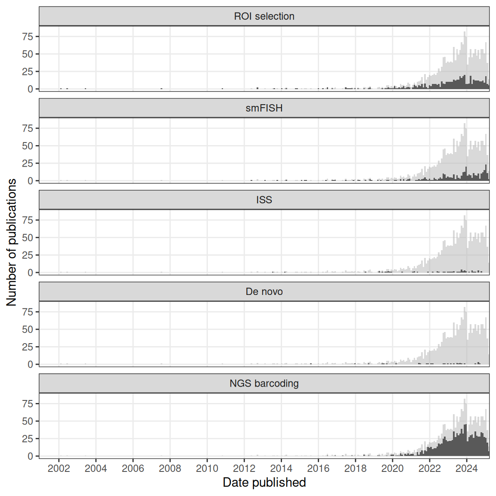
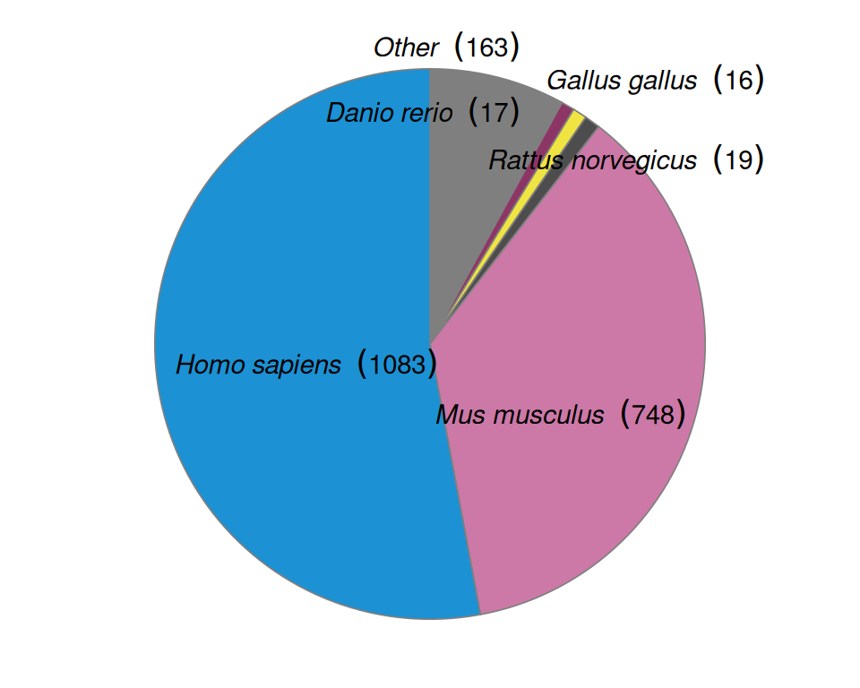

# (PART) Current era {.unnumbered}

# From the past to the present {#current}

The current era continues many of the quests of the prequel era, such as to profile the transcriptome in space, to identify genes with restricted expression, to classify gene expression patterns, to build reference gene expression atlases for model systems, and to infer anatomical regions based on gene expression. While the prequel era also sought to identify cell type markers, this has been taken over by non-spatial transcriptomics, which has been used to identify marker genes to stain for with spatial transcriptomics methods not easily scalable to the whole transcriptome. As already mentioned, (WM)ISH atlases can be understood as an improved alternative to microarray and *in situ* reporter screens, and the latter can be in turn understood as an improved alternative to enhancer and gene traps. To some extent, current era spatial transcriptomics started as an improved alternative to (WM)ISH atlases, to profile the whole transcriptome in the same cells [@Junker2014; @Lee2014]. On the other hand, part of current era of spatial transcriptomics can be seen as an improvement to bulk microarray or RNA-seq [@Brown2002; @Junker2014; @Stahl2016a; @Luo1999], and lower throughput single cell biology [@Lubeck2012; @Chen2015].

<table class="table" style="margin-left: auto; margin-right: auto;">
<caption>(\#tab:table1)Summary of spatial transcriptomics techniques in the current era</caption>
 <thead>
  <tr>
   <th style="text-align:left;"> Method </th>
   <th style="text-align:left;"> First published </th>
   <th style="text-align:left;"> Category </th>
   <th style="text-align:left;"> Max # genes </th>
   <th style="text-align:left;"> Min spot diameter ($\mu$m) </th>
  </tr>
 </thead>
<tbody>
  <tr>
   <td style="text-align:left;width: 6em; "> voxelation </td>
   <td style="text-align:left;width: 6em; "> 2002-02-01 </td>
   <td style="text-align:left;width: 6em; "> Microdissection </td>
   <td style="text-align:left;width: 6em; "> Tx wide </td>
   <td style="text-align:left;width: 6em; "> NA </td>
  </tr>
  <tr>
   <td style="text-align:left;width: 6em; "> SRM seqFISH </td>
   <td style="text-align:left;width: 6em; "> 2012-06-03 </td>
   <td style="text-align:left;width: 6em; "> smFISH </td>
   <td style="text-align:left;width: 6em; "> 32 </td>
   <td style="text-align:left;width: 6em; "> single cell </td>
  </tr>
  <tr>
   <td style="text-align:left;width: 6em; "> Tomo-array </td>
   <td style="text-align:left;width: 6em; "> 2012-09-19 </td>
   <td style="text-align:left;width: 6em; "> Microdissection </td>
   <td style="text-align:left;width: 6em; "> Tx wide </td>
   <td style="text-align:left;width: 6em; "> NA </td>
  </tr>
  <tr>
   <td style="text-align:left;width: 6em; "> iceFISH </td>
   <td style="text-align:left;width: 6em; "> 2013-02-17 </td>
   <td style="text-align:left;width: 6em; "> smFISH </td>
   <td style="text-align:left;width: 6em; "> 20 </td>
   <td style="text-align:left;width: 6em; "> single cell </td>
  </tr>
  <tr>
   <td style="text-align:left;width: 6em; "> ISS </td>
   <td style="text-align:left;width: 6em; "> 2013-07-14 </td>
   <td style="text-align:left;width: 6em; "> ISS </td>
   <td style="text-align:left;width: 6em; "> 222 </td>
   <td style="text-align:left;width: 6em; "> single cell </td>
  </tr>
  <tr>
   <td style="text-align:left;width: 6em; "> Tomo-seq </td>
   <td style="text-align:left;width: 6em; "> 2013-08-12 </td>
   <td style="text-align:left;width: 6em; "> Microdissection </td>
   <td style="text-align:left;width: 6em; "> Tx wide </td>
   <td style="text-align:left;width: 6em; "> NA </td>
  </tr>
  <tr>
   <td style="text-align:left;width: 6em; "> bDNA-smFISH </td>
   <td style="text-align:left;width: 6em; "> 2013-10-06 </td>
   <td style="text-align:left;width: 6em; "> smFISH </td>
   <td style="text-align:left;width: 6em; "> 928 </td>
   <td style="text-align:left;width: 6em; "> single cell </td>
  </tr>
  <tr>
   <td style="text-align:left;width: 6em; "> TIVA </td>
   <td style="text-align:left;width: 6em; "> 2014-01-12 </td>
   <td style="text-align:left;width: 6em; "> Microdissection </td>
   <td style="text-align:left;width: 6em; "> Tx wide </td>
   <td style="text-align:left;width: 6em; "> NA </td>
  </tr>
  <tr>
   <td style="text-align:left;width: 6em; "> FISSEQ </td>
   <td style="text-align:left;width: 6em; "> 2014-03-21 </td>
   <td style="text-align:left;width: 6em; "> ISS </td>
   <td style="text-align:left;width: 6em; "> 8102 </td>
   <td style="text-align:left;width: 6em; "> single cell </td>
  </tr>
  <tr>
   <td style="text-align:left;width: 6em; "> seqFISH </td>
   <td style="text-align:left;width: 6em; "> 2014-03-28 </td>
   <td style="text-align:left;width: 6em; "> smFISH </td>
   <td style="text-align:left;width: 6em; "> 1116 </td>
   <td style="text-align:left;width: 6em; "> single cell </td>
  </tr>
  <tr>
   <td style="text-align:left;width: 6em; "> MERFISH </td>
   <td style="text-align:left;width: 6em; "> 2015-04-24 </td>
   <td style="text-align:left;width: 6em; "> smFISH </td>
   <td style="text-align:left;width: 6em; "> 4209 </td>
   <td style="text-align:left;width: 6em; "> single cell </td>
  </tr>
  <tr>
   <td style="text-align:left;width: 6em; "> Puzzle Imaging </td>
   <td style="text-align:left;width: 6em; "> 2015-07-20 </td>
   <td style="text-align:left;width: 6em; "> No imaging </td>
   <td style="text-align:left;width: 6em; "> NA </td>
   <td style="text-align:left;width: 6em; "> NA </td>
  </tr>
  <tr>
   <td style="text-align:left;width: 6em; "> Geo-seq </td>
   <td style="text-align:left;width: 6em; "> 2016-03-21 </td>
   <td style="text-align:left;width: 6em; "> Microdissection </td>
   <td style="text-align:left;width: 6em; "> Tx wide </td>
   <td style="text-align:left;width: 6em; "> NA </td>
  </tr>
  <tr>
   <td style="text-align:left;width: 6em; "> corrFISH </td>
   <td style="text-align:left;width: 6em; "> 2016-06-06 </td>
   <td style="text-align:left;width: 6em; "> smFISH </td>
   <td style="text-align:left;width: 6em; "> 10 </td>
   <td style="text-align:left;width: 6em; "> single cell </td>
  </tr>
  <tr>
   <td style="text-align:left;width: 6em; "> ST </td>
   <td style="text-align:left;width: 6em; "> 2016-07-01 </td>
   <td style="text-align:left;width: 6em; "> Array </td>
   <td style="text-align:left;width: 6em; "> Tx wide </td>
   <td style="text-align:left;width: 6em; "> 100 </td>
  </tr>
  <tr>
   <td style="text-align:left;width: 6em; "> HCR-seqFISH </td>
   <td style="text-align:left;width: 6em; "> 2016-10-19 </td>
   <td style="text-align:left;width: 6em; "> smFISH </td>
   <td style="text-align:left;width: 6em; "> 249 </td>
   <td style="text-align:left;width: 6em; "> single cell </td>
  </tr>
  <tr>
   <td style="text-align:left;width: 6em; "> punch </td>
   <td style="text-align:left;width: 6em; "> 2017-06-28 </td>
   <td style="text-align:left;width: 6em; "> Microdissection </td>
   <td style="text-align:left;width: 6em; "> Tx wide </td>
   <td style="text-align:left;width: 6em; "> NA </td>
  </tr>
  <tr>
   <td style="text-align:left;width: 6em; "> SGA </td>
   <td style="text-align:left;width: 6em; "> 2017-11-28 </td>
   <td style="text-align:left;width: 6em; "> smFISH </td>
   <td style="text-align:left;width: 6em; "> 35 </td>
   <td style="text-align:left;width: 6em; "> single cell </td>
  </tr>
  <tr>
   <td style="text-align:left;width: 6em; "> APEX-RIP </td>
   <td style="text-align:left;width: 6em; "> 2017-12-14 </td>
   <td style="text-align:left;width: 6em; "> No imaging </td>
   <td style="text-align:left;width: 6em; "> NA </td>
   <td style="text-align:left;width: 6em; "> NA </td>
  </tr>
  <tr>
   <td style="text-align:left;width: 6em; "> Niche-seq </td>
   <td style="text-align:left;width: 6em; "> 2017-12-22 </td>
   <td style="text-align:left;width: 6em; "> Microdissection </td>
   <td style="text-align:left;width: 6em; "> Tx wide </td>
   <td style="text-align:left;width: 6em; "> NA </td>
  </tr>
  <tr>
   <td style="text-align:left;width: 6em; "> ExM-MERFISH </td>
   <td style="text-align:left;width: 6em; "> 2018-03-19 </td>
   <td style="text-align:left;width: 6em; "> smFISH </td>
   <td style="text-align:left;width: 6em; "> 10050 </td>
   <td style="text-align:left;width: 6em; "> single cell </td>
  </tr>
  <tr>
   <td style="text-align:left;width: 6em; "> seqFISH+ </td>
   <td style="text-align:left;width: 6em; "> 2018-07-12 </td>
   <td style="text-align:left;width: 6em; "> smFISH </td>
   <td style="text-align:left;width: 6em; "> 10421 </td>
   <td style="text-align:left;width: 6em; "> single cell </td>
  </tr>
  <tr>
   <td style="text-align:left;width: 6em; "> STARmap </td>
   <td style="text-align:left;width: 6em; "> 2018-07-27 </td>
   <td style="text-align:left;width: 6em; "> ISS </td>
   <td style="text-align:left;width: 6em; "> 1020 </td>
   <td style="text-align:left;width: 6em; "> single cell </td>
  </tr>
  <tr>
   <td style="text-align:left;width: 6em; "> Paired-cell sequencing </td>
   <td style="text-align:left;width: 6em; "> 2018-09-17 </td>
   <td style="text-align:left;width: 6em; "> No imaging </td>
   <td style="text-align:left;width: 6em; "> NA </td>
   <td style="text-align:left;width: 6em; "> NA </td>
  </tr>
  <tr>
   <td style="text-align:left;width: 6em; "> osmFISH </td>
   <td style="text-align:left;width: 6em; "> 2018-10-30 </td>
   <td style="text-align:left;width: 6em; "> smFISH </td>
   <td style="text-align:left;width: 6em; "> 33 </td>
   <td style="text-align:left;width: 6em; "> single cell </td>
  </tr>
  <tr>
   <td style="text-align:left;width: 6em; "> GeoMX DSP </td>
   <td style="text-align:left;width: 6em; "> 2019-02-26 </td>
   <td style="text-align:left;width: 6em; "> Microdissection </td>
   <td style="text-align:left;width: 6em; "> 2093 </td>
   <td style="text-align:left;width: 6em; "> NA </td>
  </tr>
  <tr>
   <td style="text-align:left;width: 6em; "> slide-seq </td>
   <td style="text-align:left;width: 6em; "> 2019-03-29 </td>
   <td style="text-align:left;width: 6em; "> Array </td>
   <td style="text-align:left;width: 6em; "> Tx wide </td>
   <td style="text-align:left;width: 6em; "> 10 </td>
  </tr>
  <tr>
   <td style="text-align:left;width: 6em; "> bDNA-MERFISH </td>
   <td style="text-align:left;width: 6em; "> 2019-05-25 </td>
   <td style="text-align:left;width: 6em; "> smFISH </td>
   <td style="text-align:left;width: 6em; "> 130 </td>
   <td style="text-align:left;width: 6em; "> single cell </td>
  </tr>
  <tr>
   <td style="text-align:left;width: 6em; "> DNA microscopy </td>
   <td style="text-align:left;width: 6em; "> 2019-06-27 </td>
   <td style="text-align:left;width: 6em; "> No imaging </td>
   <td style="text-align:left;width: 6em; "> NA </td>
   <td style="text-align:left;width: 6em; "> NA </td>
  </tr>
  <tr>
   <td style="text-align:left;width: 6em; "> APEX-seq </td>
   <td style="text-align:left;width: 6em; "> 2019-07-11 </td>
   <td style="text-align:left;width: 6em; "> No imaging </td>
   <td style="text-align:left;width: 6em; "> NA </td>
   <td style="text-align:left;width: 6em; "> NA </td>
  </tr>
  <tr>
   <td style="text-align:left;width: 6em; "> INSTA-seq </td>
   <td style="text-align:left;width: 6em; "> 2019-08-06 </td>
   <td style="text-align:left;width: 6em; "> ISS </td>
   <td style="text-align:left;width: 6em; "> NA </td>
   <td style="text-align:left;width: 6em; "> single cell </td>
  </tr>
  <tr>
   <td style="text-align:left;width: 6em; "> PARSIFT </td>
   <td style="text-align:left;width: 6em; "> 2019-09-04 </td>
   <td style="text-align:left;width: 6em; "> No imaging </td>
   <td style="text-align:left;width: 6em; "> NA </td>
   <td style="text-align:left;width: 6em; "> NA </td>
  </tr>
  <tr>
   <td style="text-align:left;width: 6em; "> HDST </td>
   <td style="text-align:left;width: 6em; "> 2019-09-09 </td>
   <td style="text-align:left;width: 6em; "> Array </td>
   <td style="text-align:left;width: 6em; "> Tx wide </td>
   <td style="text-align:left;width: 6em; "> 2 </td>
  </tr>
  <tr>
   <td style="text-align:left;width: 6em; "> GaST-seq </td>
   <td style="text-align:left;width: 6em; "> 2019-10-10 </td>
   <td style="text-align:left;width: 6em; "> Microdissection </td>
   <td style="text-align:left;width: 6em; "> Tx wide </td>
   <td style="text-align:left;width: 6em; "> NA </td>
  </tr>
  <tr>
   <td style="text-align:left;width: 6em; "> BARseq </td>
   <td style="text-align:left;width: 6em; "> 2019-10-17 </td>
   <td style="text-align:left;width: 6em; "> ISS </td>
   <td style="text-align:left;width: 6em; "> 79 </td>
   <td style="text-align:left;width: 6em; "> single cell </td>
  </tr>
  <tr>
   <td style="text-align:left;width: 6em; "> SCRINSHOT </td>
   <td style="text-align:left;width: 6em; "> 2020-02-07 </td>
   <td style="text-align:left;width: 6em; "> smFISH </td>
   <td style="text-align:left;width: 6em; "> 29 </td>
   <td style="text-align:left;width: 6em; "> single cell </td>
  </tr>
  <tr>
   <td style="text-align:left;width: 6em; "> Visium </td>
   <td style="text-align:left;width: 6em; "> 2020-02-28 </td>
   <td style="text-align:left;width: 6em; "> Array </td>
   <td style="text-align:left;width: 6em; "> Tx wide </td>
   <td style="text-align:left;width: 6em; "> 55 </td>
  </tr>
  <tr>
   <td style="text-align:left;width: 6em; "> PIC </td>
   <td style="text-align:left;width: 6em; "> 2020-03-23 </td>
   <td style="text-align:left;width: 6em; "> Microdissection </td>
   <td style="text-align:left;width: 6em; "> Tx wide </td>
   <td style="text-align:left;width: 6em; "> NA </td>
  </tr>
  <tr>
   <td style="text-align:left;width: 6em; "> miRNA nanowell </td>
   <td style="text-align:left;width: 6em; "> 2020-05-09 </td>
   <td style="text-align:left;width: 6em; "> Array </td>
   <td style="text-align:left;width: 6em; "> 9 </td>
   <td style="text-align:left;width: 6em; "> 300 </td>
  </tr>
  <tr>
   <td style="text-align:left;width: 6em; "> split-FISH </td>
   <td style="text-align:left;width: 6em; "> 2020-06-15 </td>
   <td style="text-align:left;width: 6em; "> smFISH </td>
   <td style="text-align:left;width: 6em; "> 317 </td>
   <td style="text-align:left;width: 6em; "> single cell </td>
  </tr>
  <tr>
   <td style="text-align:left;width: 6em; "> HybISS </td>
   <td style="text-align:left;width: 6em; "> 2020-07-03 </td>
   <td style="text-align:left;width: 6em; "> smFISH </td>
   <td style="text-align:left;width: 6em; "> 120 </td>
   <td style="text-align:left;width: 6em; "> single cell </td>
  </tr>
  <tr>
   <td style="text-align:left;width: 6em; "> ZipSeq </td>
   <td style="text-align:left;width: 6em; "> 2020-07-06 </td>
   <td style="text-align:left;width: 6em; "> Microdissection </td>
   <td style="text-align:left;width: 6em; "> Tx wide </td>
   <td style="text-align:left;width: 6em; "> NA </td>
  </tr>
  <tr>
   <td style="text-align:left;width: 6em; "> ClumpSeq </td>
   <td style="text-align:left;width: 6em; "> 2020-08-06 </td>
   <td style="text-align:left;width: 6em; "> No imaging </td>
   <td style="text-align:left;width: 6em; "> NA </td>
   <td style="text-align:left;width: 6em; "> NA </td>
  </tr>
  <tr>
   <td style="text-align:left;width: 6em; "> BARseq2 </td>
   <td style="text-align:left;width: 6em; "> 2020-08-26 </td>
   <td style="text-align:left;width: 6em; "> ISS </td>
   <td style="text-align:left;width: 6em; "> 65 </td>
   <td style="text-align:left;width: 6em; "> single cell </td>
  </tr>
  <tr>
   <td style="text-align:left;width: 6em; "> SM-Omics </td>
   <td style="text-align:left;width: 6em; "> 2020-10-15 </td>
   <td style="text-align:left;width: 6em; "> Array </td>
   <td style="text-align:left;width: 6em; "> Tx wide </td>
   <td style="text-align:left;width: 6em; "> 100 </td>
  </tr>
  <tr>
   <td style="text-align:left;width: 6em; "> slide-seq2 </td>
   <td style="text-align:left;width: 6em; "> 2020-10-17 </td>
   <td style="text-align:left;width: 6em; "> Array </td>
   <td style="text-align:left;width: 6em; "> Tx wide </td>
   <td style="text-align:left;width: 6em; "> 10 </td>
  </tr>
  <tr>
   <td style="text-align:left;width: 6em; "> DBiT-seq </td>
   <td style="text-align:left;width: 6em; "> 2020-10-19 </td>
   <td style="text-align:left;width: 6em; "> Array </td>
   <td style="text-align:left;width: 6em; "> Tx wide </td>
   <td style="text-align:left;width: 6em; "> 10 </td>
  </tr>
  <tr>
   <td style="text-align:left;width: 6em; "> C-FISH </td>
   <td style="text-align:left;width: 6em; "> 2020-10-23 </td>
   <td style="text-align:left;width: 6em; "> smFISH </td>
   <td style="text-align:left;width: 6em; "> 2 </td>
   <td style="text-align:left;width: 6em; "> single cell </td>
  </tr>
  <tr>
   <td style="text-align:left;width: 6em; "> HybRISS </td>
   <td style="text-align:left;width: 6em; "> 2020-12-02 </td>
   <td style="text-align:left;width: 6em; "> smFISH </td>
   <td style="text-align:left;width: 6em; "> 50 </td>
   <td style="text-align:left;width: 6em; "> single cell </td>
  </tr>
  <tr>
   <td style="text-align:left;width: 6em; "> Stereo-seq </td>
   <td style="text-align:left;width: 6em; "> 2021-01-19 </td>
   <td style="text-align:left;width: 6em; "> Array </td>
   <td style="text-align:left;width: 6em; "> Tx wide </td>
   <td style="text-align:left;width: 6em; "> 0.22 </td>
  </tr>
  <tr>
   <td style="text-align:left;width: 6em; "> Seq-Scope </td>
   <td style="text-align:left;width: 6em; "> 2021-01-27 </td>
   <td style="text-align:left;width: 6em; "> Array </td>
   <td style="text-align:left;width: 6em; "> Tx wide </td>
   <td style="text-align:left;width: 6em; "> 0.5 </td>
  </tr>
  <tr>
   <td style="text-align:left;width: 6em; "> ExSeq </td>
   <td style="text-align:left;width: 6em; "> 2021-01-29 </td>
   <td style="text-align:left;width: 6em; "> ISS </td>
   <td style="text-align:left;width: 6em; "> 297 </td>
   <td style="text-align:left;width: 6em; "> single cell </td>
  </tr>
  <tr>
   <td style="text-align:left;width: 6em; "> par-seqFISH </td>
   <td style="text-align:left;width: 6em; "> 2021-02-25 </td>
   <td style="text-align:left;width: 6em; "> smFISH </td>
   <td style="text-align:left;width: 6em; "> 105 </td>
   <td style="text-align:left;width: 6em; "> single cell </td>
  </tr>
  <tr>
   <td style="text-align:left;width: 6em; "> EASI-FISH </td>
   <td style="text-align:left;width: 6em; "> 2021-03-08 </td>
   <td style="text-align:left;width: 6em; "> smFISH </td>
   <td style="text-align:left;width: 6em; "> 26 </td>
   <td style="text-align:left;width: 6em; "> single cell </td>
  </tr>
  <tr>
   <td style="text-align:left;width: 6em; "> Pick-Seq </td>
   <td style="text-align:left;width: 6em; "> 2021-03-09 </td>
   <td style="text-align:left;width: 6em; "> Microdissection </td>
   <td style="text-align:left;width: 6em; "> Tx wide </td>
   <td style="text-align:left;width: 6em; "> NA </td>
  </tr>
  <tr>
   <td style="text-align:left;width: 6em; "> nanoneedles </td>
   <td style="text-align:left;width: 6em; "> 2021-03-10 </td>
   <td style="text-align:left;width: 6em; "> Microdissection </td>
   <td style="text-align:left;width: 6em; "> 9 </td>
   <td style="text-align:left;width: 6em; "> NA </td>
  </tr>
  <tr>
   <td style="text-align:left;width: 6em; "> PIXEL-seq </td>
   <td style="text-align:left;width: 6em; "> 2021-03-17 </td>
   <td style="text-align:left;width: 6em; "> Array </td>
   <td style="text-align:left;width: 6em; "> Tx wide </td>
   <td style="text-align:left;width: 6em; "> 1.22 </td>
  </tr>
  <tr>
   <td style="text-align:left;width: 6em; "> GeoMX WTA </td>
   <td style="text-align:left;width: 6em; "> 2021-03-20 </td>
   <td style="text-align:left;width: 6em; "> Microdissection </td>
   <td style="text-align:left;width: 6em; "> 18190 </td>
   <td style="text-align:left;width: 6em; "> NA </td>
  </tr>
  <tr>
   <td style="text-align:left;width: 6em; "> CISI </td>
   <td style="text-align:left;width: 6em; "> 2021-04-15 </td>
   <td style="text-align:left;width: 6em; "> smFISH </td>
   <td style="text-align:left;width: 6em; "> 37 </td>
   <td style="text-align:left;width: 6em; "> single cell </td>
  </tr>
  <tr>
   <td style="text-align:left;width: 6em; "> STRP-seq </td>
   <td style="text-align:left;width: 6em; "> 2021-04-19 </td>
   <td style="text-align:left;width: 6em; "> Microdissection </td>
   <td style="text-align:left;width: 6em; "> Tx wide </td>
   <td style="text-align:left;width: 6em; "> NA </td>
  </tr>
  <tr>
   <td style="text-align:left;width: 6em; "> XYZeq </td>
   <td style="text-align:left;width: 6em; "> 2021-04-21 </td>
   <td style="text-align:left;width: 6em; "> Array </td>
   <td style="text-align:left;width: 6em; "> Tx wide </td>
   <td style="text-align:left;width: 6em; "> 500 </td>
  </tr>
  <tr>
   <td style="text-align:left;width: 6em; "> electro-seq </td>
   <td style="text-align:left;width: 6em; "> 2021-04-23 </td>
   <td style="text-align:left;width: 6em; "> ISS </td>
   <td style="text-align:left;width: 6em; "> 201 </td>
   <td style="text-align:left;width: 6em; "> single cell </td>
  </tr>
  <tr>
   <td style="text-align:left;width: 6em; "> centrifugation on 384 well plate </td>
   <td style="text-align:left;width: 6em; "> 2021-04-30 </td>
   <td style="text-align:left;width: 6em; "> Microdissection </td>
   <td style="text-align:left;width: 6em; "> Tx wide </td>
   <td style="text-align:left;width: 6em; "> NA </td>
  </tr>
</tbody>
</table>

The current era started with LCM followed by microarray in 1999 [@Luo1999]. Due to the immense popularity of LCM followed by microarray or RNA-seq, the body of LCM literature is too vast for unbiased and comprehensive manual curation, so the curated database does not include most LCM literature, which was instead collected from a PubMed search and text mined (Figure \@ref(fig:topics), Chapter \@ref(text-mining). Because the search results---without manual inspection and curation---may contain irrelevant entries and miss relevant ones, they are separated from the curated database in our analyses. Current era literature in the curated database is classified into Microdissection, smFISH, ISS, Array, and No Imaging, to be defined in detail in their corresponding sections below.

(\#fig:current-hist)Number of publications over time in the current era. The gray histogram in the background is the overall trend of all current era literature. Each facet highlights a category, ordered chronologically in terms of first report. Bin width is 365 days. Plots in this figure include curated LCM literature, but not the non-curated literature.

Chronologically, in the curated database, microdissection came first, with voxelation in 2002 [@Brown2002], followed by smFISH, ISS, no imaging, and array (Figure \@ref(fig:current-hist)). Despite an early start in the midst of the (WM)ISH golden age, if not including non-curated LCM literature, the current era did not really take off until around 2014 (Figure \@ref(fig:current-vs-prequel)). Ever since, its has seen drastic growth, far exceeding that of the prequel era in the 1990s and 2000s (Figure \@ref(fig:current-vs-prequel)). Growth in microdissection and array seemed to have contributed the most to this overall drastic growth (Figure \@ref(fig:current-hist)). All techniques in the curated database, along with their classification, maximum number of genes, spatial resolution, and references are listed in Table \@ref(tab:table1). A timeline of major techniques in the current era is shown in Figure \@ref(fig:tl3).

(\#fig:current-vs-prequel)Comparing number of publications over time in the prequel and the current eras. Bin width is 365 days. Note that the number is lower in 2021 because this figure was rendered in April 2021.

(\#fig:tl3)Timeline of major techniques related to the current era.

The prequel era started with untargeted screens and grew into atlases and databases striving to be comprehensive. Screens are still a theme in the current era and spatial transcriptomics is still used in untargeted searches for genes involved in development of model organisms, but with highly multiplexed technology, this can also be done for pathological and human tissues (Figure \@ref(fig:species-pie), Figure \@ref(fig:hg-anat)). Thanks to multiplexing, while mouse was the most popular species in the prequel era, in the current era, there are almost as many studies on human tissues as those on mice and the vast majority of studies are on either humans or mice (Figure \@ref(fig:species-pie)). *Drosophila* is no longer as commonly used in the current era (Figure \@ref(fig:species-pie)), perhaps because any current era technique requiring tissue sectioning is less amenable to *Drosophila* embryos, making Tomo-seq along one body axis the only technique that has been demonstrated to be amenable [@Combs2013; @Combs2018]. Whole mount smFISH protocols exist for *Drosophila* brains [@Long2017], zebrafish embryos [@Oka2015], and embryonic mouse organs [@Wang2019], but to our best knowledge, highly multiplexed smFISH and ISS have not been adapted to whole mount samples, although they have been adapted to thick slices of cleared tissue [@Wang2018b; @Wang2021]. For *Drosophila* tissue sections, while microdissection, smFISH, and ISS may be applied, the resolution of ST and Visium may be too low to discern sufficiently fine patterns in such a small model organism.

(\#fig:species-pie)Number of publication per species.

(ref:hg-anat-cat) A) Number of publications for each healthy organ in human (male shown here, as there is no study on healthy female specific organs in humans at present). B) Number of publications for pathological organs in human (female shown here, but there are two studies on prostate cancer [@Burgess2019; @Brady2021]).

(\#fig:hg-anat)(ref:hg-anat-cat)

While atlases have so far not been in the center of the stage, some atlases have been made with current era technology, such as MERFISH [@Zhang2020], HybISS [@Manno2020], and ST [@Ortiz2020], described with similar language to that of (WM)ISH atlases. Also as in the prequel era, the brain is still the most favored organ (Figure \@ref(fig:hg-anat), Figure \@ref(fig:mm-anat)). Among pathological tissues, breast tumors are the most used (Figure \@ref(fig:hg-anat)). More recently, in the wake of the SARS-CoV-2 pandemic, a number of studies using GeoMX Digital Spatial Profiler (DSP) to profile spatial transcriptomes of lungs of COVID victims have been published [@Park2021; @Butler2021; @Delorey2021; @Margaroli2021].

(\#fig:mm-anat)A) Number of publications per healthy organ in the mouse. B) Number of publications for pathological organs in mouse.

However, unlike in the prequel era, in which older technologies were adapted to larger scale to produce the screens and atlases, the current era has another major theme -- new techniques, due to the challenges to be discussed in the following sections; the number of new techniques published each year has grown steadily in the past few years (Figure \@ref(fig:n-insts)). However, this difference might be due to bias in curation and change in culture. In the prequel era, very different enhancer and gene trap vectors were lumped together into enhancer or gene trap in our database, and there might have been many different early non-radioactive ISH protocols not included in our database because they were not used to profile a sufficiently large number of genes. Furthermore, in the current era, authors like to give techniques new names, making related techniques seem distinct rather than lumped together in a wider category like enhancer or gene trap. While a few techniques other than LCM have become somewhat popular, such as ISS (2013), Tomo-seq (2013), MERFISH (2015), ST (late 2016), GeoMX DSP (2019), and Visium (first preprint in 2020), most techniques never or rarely spread beyond their institutions of origin (Figure \@ref(fig:n-insts)).

(\#fig:n-insts)Techniques used by at least 3 institutions and the number of institutions that have used them.

(\#fig:n-insts-hist)Number of new methods per year, colored by the number of institutions that have used the method.

Furthermore, especially in the US, research in the current era tends to be more concentrated in a few elite institutions, while research in the prequel era tends to be more spread out to some less well-known institutions (Figure \@ref(fig:current-world)). Among the top contributing institutions in the prequel era are those hosting databases, such as Allen Institute for ABA, University of Oregon (UO) for ZFIN, UC Berkeley and Lawrence Berkeley National Laboratory (LBL) for BDGP, University of Arizona (UofA) for GEISHA, Jackson Laboratory (JAX) for GXD, Western General Hospital (WGH) for EMAGE, and Kyoto University (Kyodai) for GHOST (Figure \@ref(fig:current-world)).

(\#fig:current-world)World map of institutions. Area of the point is proportional to the number of publications from that city. Gray points are sum of both prequel and current eras for each city. Top 10 institutions in each era are labeled.

