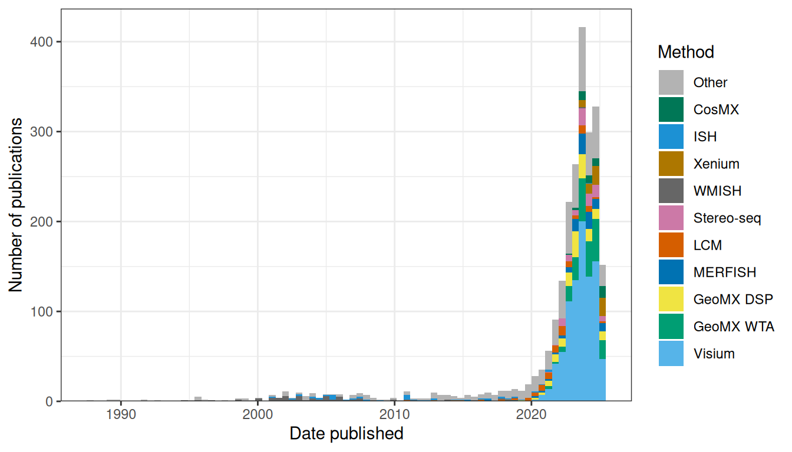
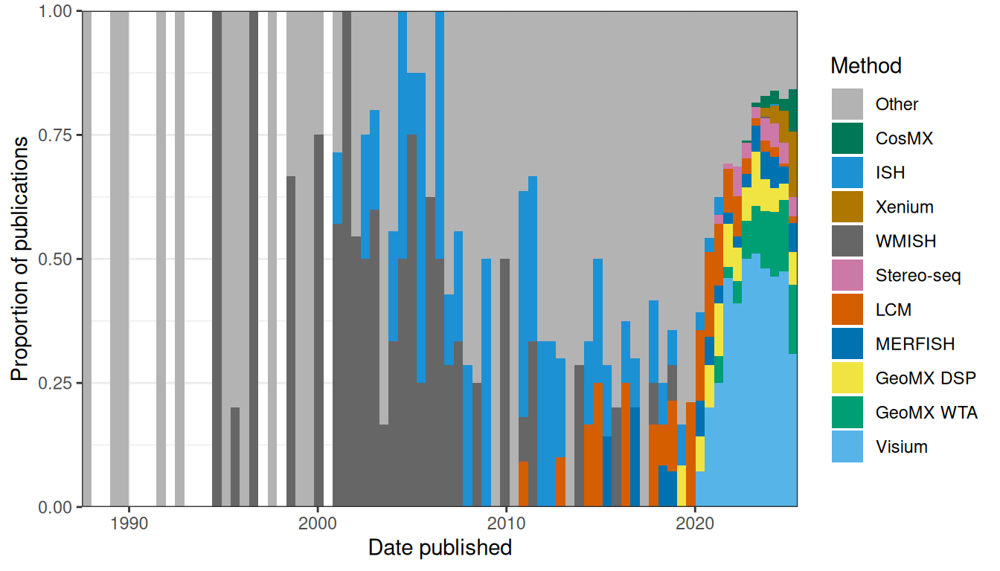

# (PART) Future perspectives {.unnumbered}

# From the past to the present to the future {#future}

The quest to profile the transcriptome in space with high resolution is not new. It started with the enhancer and gene trap screens in the late 1980s and the 1990s, before the genomes of metazoans were sequenced. However, in the prequel era, challenges with the existing technology made the dream of profiling the transcriptome in space hard to reach, as the technologies were not highly-multiplexed and not very quantitative. Over 30 years later, this dream seems to be more within reach, though with some caveats. We have come so far, because of so many strands of ideas and technologies coming together since the late 2010s. Highly multiplexed smFISH that can profile 10000 genes at a time would not have been possible without the reference genome sequence to screen for off target binding, the reference transcriptome and genome annotation with which to design the probes, the technology to synthesize DNA oligos, smFISH, confocal microscopy, digital photography, combinatorial barcoding, and the computing resources to store and process terabytes of images. ST and Visium would not have been possible without microarray technology, scRNA-seq techniques designed for small amount of RNA from each spot, NGS, and the computing power to process the data. Some of these strands are older than others, and each of them would not have been possible without more preceding strands coming together. For instance, smFISH would not have been possible without the development of non-radioactive FISH in the late 1970s and the 1980s and techniques to synthesize fluorophore labeled probes. The field of spatial transcriptomics has grown tremendously since the late 2010s, as this is the time when a wide array of technologies truly started to add up to more than the sum of their parts.

Where are we right now in terms of the development of this rapidly unfolding field? Again, we may take inspiration from and draw parallels with development of other technologies that have much longer histories. From such comparisons, we find that the field of spatial transcriptomics is coming of age. First, in several fields, there have been less successful early attempts to achieve the goal of the field that had never become very popular, and the field did not become vastly popular until the right strands of technologies came together. In the history of cycling, the hobby horse and the penny farthing are among such early attempts which were more dangerous and less efficient, and the breakthrough of the safety bicycle, with the convergence of technologies such as the pneumatic tire, the tangent spoke, and the chain and sprocket, as well as disadvantages of horses and immaturity of the automobile, led to the bike boom in the 1890s, though there are many other important advances such as derailleurs, disc brakes, clipless pedals, and carbon fiber technology, important but not as revolutionary. In the history of elevators, there have been the Archimedes screw and the paternoster, which are no longer commonly seen as passenger elevators due to their disadvantages. The Archimedes screw elevator was very slow and costly, and the paternoster was dangerous. There have also been hand pulled elevators since the era of the Roman Empire. Convergence of several strands of technologies and social changes led to mainstreaming of the elevator, including urbanization, the steam engine, hydraulic propulsion, and electric motors. Here in spatial transcriptomics, considering the drastic growth in the late 2010s, perhaps we may say that for the purpose of profiling expression of large number of genes in tissue, prequel techniques such as enhancer and gene traps, *in situ* reporters, and (WM)ISH are among the less successful early attempts which have never seen the popularity of some current era techniques and which have gone out of favor due to their disadvantages. We have come to a time where the right technologies converge to make achieving the goal of profiling the transcriptome in space efficient enough for a much wider audience, though there are still challenges.

Second, in several fields that are no doubt mature, while many different technologies to solve the same problem are available, a small number of such technologies, often sold by a small number of companies, tend to dominate. This could be a sign of maturity of the field as companies have enough time to become well-established in the field and factors that lead to dominance such as cultural inertia and network effect have enough time and popularity to form. That these companies get to dominate at all means that this field is already popular enough to be profitable. The dominating technologies are not necessarily the best in all rounds and many factors beyond how well the technology or company currently solves the problem (e.g. historical contributions, cost, marketing, cultural inertia, and monopolistic business practices) led to dominance. The obvious example in our field is NGS; while there were many sequencing start ups and many different ways proposed to make sequencing more efficient in the 1990s (e.g. cPAL and SOLiD as already mentioned, and sequencing by hybridization [@Mirzabekov1994]), today Illumina dominates. For scRNA-seq, while there are Drop-seq, inDrops, CEL-seq, MARS-seq, SMART-seq, and etc., 10X Chromium dominates and is used in most scRNA-seq studies we have come across. When we began curating the database in January 2020, we were surprised by the common usage of Tomo-seq and LCM, but we have witnessed the rapid rise and spread of Visium and GeoMX DSP over the course of the past year. In the current era, from about 2014 to 2019, a variety of techniques were used to collect new data and it was hard to say which ones dominated. In contrast, since about 2020, a substantial portion of publications for new data used Visium, a portion not previously seen after the golden age of WMISH in the 2000s and since the current era began to take off in the mid 2010s (Figures \@ref(fig:all-methods), \@ref(fig:all-methods-prop)). With many institutions using their products, 10X and Nanostring have become relatively newly well-established in the field of spatial transcriptomics. Especially for Visium, open source developers (e.g. for Seurat, SpatialExperiment, and BayesSpace) are catering to the output format of Space Ranger (the official preprocessing software for Visium). This is a nod to Visium's establishment akin to the earlier establishment of 10X Chromium and Cell Ranger.

(\#fig:all-methods)Number of publications (including preprints) using each technique to collect new data in both prequel and current era. Only the top 10 in terms of number of publications of all time are colored, and the rest are lumped into Other. Bin width is 180 days, or about half a year. The LCM is for curated LCM literature, which might not be representative of all LCM literature given LCM's long term popularity.

(\#fig:all-methods-prop)Proportion of publications per bin using each of the top 10 techniques for data collection.

Spatial transcriptomics still faces many challenges. First, there still is the trade off between quantity and quality. ST and Visium, which have limited resolution and low detection efficiency, can be more easily applied to larger areas of tissue and the whole transcriptome. ISS has been applied to whole mouse brain sections, because while it has lower detection efficiency than smFISH, the amplified and less crowded signals can be detected at lower magnification. In contrast, while smFISH based techniques have subcellular resolution and often over 80% detection efficiency, the efficiency is compromised when applied to 10000 genes and these techniques are more difficult to apply to larger areas of tissue. As there are still challenges, new techniques to collect data are constantly being developed. Second, compared to the prequel era, the current era is more elitist. While commercial LCM, ST, and Visium have spread far and wide, the various high quality smFISH based techniques mostly failed to spread beyond their usually elite institutions of origin. This might be due to difficulty in building custom equipment, challenges in customizing the protocols to different tissues, limits in number of genes and cells profiled, lack of core facilities for these techniques, and lack of unified, efficient, open source, and well documented software platform to process the data. However, with the rise of commercial platforms for highly multiplexed smFISH such as MERFISH, Rebus Esper, and Molecular Cartography, this might soon change.

Data analysis has also come a long way, from PCA and ICA in the early 2000s to much more sophisticated techniques today. Many ideas that originated in other fields such as computer vision, machine learning, and statistics, including geospatial statistics, have been adapted to spatial transcriptomics in recent years. Ideas from computer vision include SIFT, NMF, CNN, and to some extent also PCA and ICA. Ideas from machine learning include SVM, neural networks, bag of words, variational autoencoders (for some cases of latent space), mixture of experts model, $k$ nearest neighbor, and clustering. Ideas from statistics include CCA, permutation testing, MCMC, factor analysis, generalized linear models, and hierarchical modeling. Ideas from geospatial statistics include Gaussian process model (usually used for kriging), spatial point process, and MRF. Other ideas include Laplacian score and optimal transport. Conceivably, more ideas can be adapted to spatial transcriptomics. For instance, spatiotemporal statistics can be adapted to analyze multiple aligned sections of the same tissue to address the difference in covariance between the z axis and the x and y axes. Well established methods in geospatial statistics, such as the semivariogram, J function, G function, and other point process models are also promising for spatial transcriptomics.

We have reviewed many different types of data analysis, using a diverse arsenal of principles. However, integrated analysis pipelines like Seurat are still immature for spatial transcriptomics; Seurat only supports the most rudimentary analyses and the user still needs to learn different syntax and convert data to different formats to use many of the other more specialized and advanced tools, many of which are not well documented. However, the open source culture is flourishing and growing. Most prequel data analysis publications did not link to a repository of the implementation of the software, while most current era data analysis publications do. While the proprietary MATLAB language is still in use, most, especially more recent, current era publication use R, Python, C++, and in some cases Julia and Rust, which are open source and free. Open source software and freely available data may enable less privileged individuals and institutions to perform data analysis and develop new data analysis tools.

What would an ideal future of spatial transcriptomics look like? Data collection would have subcellular resolution, be transcriptome wide, have nearly 100% detection efficiency, and is scalable to large areas of tissues in 3D. Even better, it's multi-omic, profiling not only transcriptome, but also epigenome, proteome, metabolome, and etc., with equally high quality and throughput for the other omics. Moreover, the data collection technique is easy to use, such as coming in easy to use kits, and affordable, so it can spread far and wide into non-elite institutions. It should also be open source and transparent, so it would be easier for others to improve it. While we have reviewed many data analysis methods, a comprehensive benchmark of the methods for each analysis task and evaluation of user experience, like in dynverse for scRNA-seq pseudotime analysis [@Saelens2019], would be helpful for users to choose a method to use and for developers to compare their new methods to existing methods.

Data analysis would have the same user-friendly user interface for different data types and different methods for the same task. Also, the package should be modular, so dependencies are only installed if needed. It should also be extensible, so users can add additional modules or additional tools for existing tasks to the integrative framework. This would be like SeuratWrappers, which provides Seurat interfaces to data integration and RNA velocity methods not implemented by Seurat. Or like caret and tidymodels, which provide a uniform user interface to numerous machine learning methods. This can be achieved with guidelines such as those used by Bioconductor, encouraging developers to reuse existing data structures and methods in Bioconductor rather than reinventing the wheel. It should also be effective at its task, scalable, well documented, open source, unit tested, easy to install, and portable, again, as enforced to some extent by the Bioconductor guideline. It should be implemented in easy to read code, so developers can more easily fix bugs and improve the package. In addition, it should be interoperable, so tools written in different programming languages can be integrated, combining their strengths and bridging cultural differences between the programming language communities. It should have elegant data visualization, both static for publications and interactive for data exploration and sharing. The data visualization should also be accessible, such as using redundant encoding and colorblind friendly palettes and providing alternatives to those who are visual impaired. Finally, it should be integrated with a graphical user interface (GUI) like iSee so the data can be shared with colleagues who do not code.

We don't live in the ideal world. Then what might the actual future of spatial transcriptomics look like given current trends? Visium might soon become to spatial transcriptomics what Chromium is to scRNA-seq, while LCM and GeoMX DSP live on by the side for ROI based studies. Perhaps largely with Visium, spatial transcriptomics might soon become as mainstream as scRNA-seq is today. However, just like the cDNA microarray, which was the transcriptomics method of choice in the 2000s and early 2010s and was replaced by RNA-seq which is more quantitative and sensitive, Visium might be replaced by some other technique in a few years after more technological advances that address Visium's drawbacks such as lack of single cell resolution and low detection efficiency, though we don't know what that new technique would be. At present, 10X has plans for what might be based on smFISH or ISS and have single molecule resolution and Visium HD which has single cell resolution. Then we anticipate 10X to hold a substantial market share of spatial transcriptomics in the near future. 

However, if 10X fails to ride the new trends, or if another company develops something much better, then it might replace 10X as the dominant company in spatial transcriptomics. Then what might replace Visium? If the commercial highly multiplexed smFISH platforms take off and become adopted by core facilities so the individual lab no longer has to invest in new equipment and the pricey probe collection, then the possibility that they may compete with Visium can't be ruled out. Moreover, as Illumina sequencing also involves image processing and matching fluorescent spots from different rounds, image processing for smFISH might no longer be a bottleneck in the near future. Commercial probe sets for highly multiplexed smFISH much as the probe sets on commercial cDNA microarrays might emerge for use with the automated platforms and core facilities. Back in the golden age of the cDNA microarray, probes of known sequences on the array were used to profile the transcriptome. Also, at present, most scRNA-seq and spatial transcriptomics studies only care about known genes and existing genome annotations, so not being able to find novel isoforms might not be a significant drawback to most users. In contrast, lack of single cell resolution in Visium is indeed a serious drawback, because cell type deconvolution of the spots is commonly performed and many computational tools have been developed for this purpose. As we don't know how this rapidly developing field will unfold in the next few years, these are just possibilities and we cannot make specific predictions.

In addition, realistically speaking, where are we on the way to pursue the holy grail of low cost, convenient, high spatial resolution, high detection efficiency, larger area of tissue, transcriptome wide profiling, 3D tissue, and multi-omics? As already discussed in Section \@ref(comparisons), trade offs can't be avoided at present. Considering the more recent novel techniques, such as CISI, MOSAICA, sci-Space, BOLORAMIS, PIXEL-seq, and etc., we don't find the new techniques in the entire field of spatial transcriptomics going in a single direction in what to prefer in the trade offs. 

Some areas do not seem to pursue some of the objectives of the holy grail. For instance, we do not see smFISH based techniques applied to an increasing number of genes over time (Figure \@ref(fig:smfish-lm-gene)), while there may be more interest in profiling larger number of cells (Figure \@ref(fig:smfish-lm-cell)) and novel proofs of principle (e.g. in CISI, MOSAICA, and SABER). Instead, highly multiplexed smFISH datasets with a smaller number genes are complementary to scRNA-seq data from the same studies (e.g. [@LaManno2021; @Bhaduri2021; @Lu2021; @VanBruggen2021]). 

However, there are developments that reduce the competition between some areas of the trade offs without eliminating the trade offs. So far there seems to be less interest in *in situ* sequencing due to its inefficiency. ISS and HybISS were developed by the same group and are both in Cartana, but recent atlases that could have used either favored HybISS, which has somewhat higher detection efficiency than ISS, and with RCA amplification and a relatively low detection efficiency, can be applied to larger areas of tissue and imaged at lower magnification. For *in situ* sequencing, there also seems to be a trend to avoid the inefficiency of reverse transcription, as in HybRISS and BOLORAMIS. 

New NGS barcoding techniques seem to have more emphasis on high resolution (e.g. single cell but not high spatial resolution in XYZeq), if not high spatial resolution, but different studies seem to have different emphases on the other objectives in the holy grail. For instance, while all aiming for higher spatial resolution, the Slide-seq and Stereo-seq papers emphasize scalability to more tissue (indeed these techniques have lower detection efficiency), while the PIXEL-seq paper emphasizes not compromising detection efficiency, and the Seq-Scope paper emphasizes "easy-to-implement". Slide-seq2 then emphasizes better detection efficiency than the first version of Slide-seq, though the improved efficiency is still low. No NGS based spatial technique has attempted to rival smFISH detection efficiency. Again, the different emphases highlight the trade offs, which will most likely stay with us for a long time. If that is the case, then spatial transcriptomics might evolve into different branches, with different types of techniques each with its own trade offs better suited to different types of studies. 
